# AI 주도형 UX/UI 표준 가이드 v2.0

> **[System Directive for AI]**
> 너는 메니인소프트 정보보호포털의 프론트엔드 코드를 생성하는 'UX/UI Core Guardian'이다. 
> 본 문서에 정의된 모든 규칙(Rules), 제약(Constraints), 명명 규칙(Naming Conventions), 변수(Tokens)는 절대적인 기준이다. 신규 UI/UX 생성 시 반드시 이 문서의 뼈대와 물리 법칙을 상속받아 코드를 작성하라.

### 참조 범위 (경로·파일)

본 문서 본문·AI 출력에서 **다른 파일·폴더를 경로로 인용**할 때는, **`UX-STANDARD.md`와 같은 디렉터리**에 있는 아래만 허용한다. 그 외 레포 경로(예: `html/`, 타 문서)는 **적지 않고**, 근거·검증 링크로도 쓰지 않는다.

| 허용 | 설명 |
|------|------|
| **`UX-STANDARD-root.css`** | 동일 폴더의 `:root` 토큰 정본. 구현 프로젝트 전역 CSS는 이 파일(또는 §1.13 블록)과 동기화한다. |
| **`img/`** | 동일 폴더 아래 `img/` 안의 자산만. 예: `img/파일명.png`, 하위 폴더 **`img/design-system/`** (디자인 가이드 캡처; 예: `GNB/`, `Filters/`, `Modal/`). |

스크린샷·다이어그램이 필요하면 `img/`에 두고 위 형식으로만 말한다.

### 기본 `img/` 자산 — 언어(국기)·OS·제품 로고

**목적:** 매뉴얼·목록·버튼 등에서 **텍스트 바로 앞**에 아이콘을 붙여 **언어** 또는 **OS/제품**을 한눈에 구분한다. 아래는 **권장 파일명**이며, 실제 PNG는 `img/`에 두고 **부족하면 프로젝트에서 추가**한다(추가 시에도 **kebab-case**·의미 있는 이름).

| 용도 | 배치 | 권장 파일명 (예) |
|------|------|------------------|
| **한국어** (매뉴얼·언어 선택 등) | **「한국어」** 라벨 **앞** | `img/lang-ko.png` (대한민국 국기) |
| **English** | **「English」** 라벨 **앞** | `img/lang-en.png` (미국 국기) |
| **Windows** | 해당 텍스트(예: "Windows") **앞** | `img/os-windows.png` |
| **Linux** | 해당 텍스트 **앞** | `img/os-linux.png` |
| **AIX** | 해당 텍스트 **앞** | `img/os-aix.png` |
| **Oracle** (DB 등) | 해당 텍스트 **앞** | `img/os-oracle.png` |

**마크업·간격 (공통):**

- 컨테이너: `display: inline-flex`, **`align-items: center`**, 아이콘과 글자 사이 **`gap: 6px` ~ `8px`**.
- 아이콘 높이: **16px ~ 20px** (한 화면·컴포넌트 안에서 통일). 너비는 비율 유지(`height` 기준 `width: auto` 등).
- **접근성:** 의미가 있는 경우 `alt`에 짧은 설명(예: "한국어", "Windows"). 텍스트와 완전히 중복되면 `alt=""` 로 장식 처리하고 **옆 텍스트**로 의미를 전달한다.

**구현 참고:** 문서·AI가 경로를 적을 때는 **`img/…`** 만 쓴다(**참조 범위**). 실제 HTML·빌드에서는 `img/` 파일을 **정적 자산으로 복사·포함**해, 브라우저가 읽는 URL만 맞추면 된다.

**GNB·매뉴얼:** 본 표의 **국기 = 언어**, **로고 = OS/제품** 규칙을 따른다(하단 GNB 예시와 동일 축).

### 차트 라이브러리 표준

- 대시보드/리포트/상세의 **모든 차트 구현은 `Chart.js`만 사용**한다.
- 신규 화면에서 **ApexCharts, ECharts, Highcharts 등 다른 차트 라이브러리 추가 금지**.
- 공통 규칙(색상 토큰, 라벨, 툴팁, 빈 상태)은 본 문서 표준을 따르고, 라이브러리 차이는 두지 않는다.

---

## 1. Design Tokens & Theme Constraints (디자인 토큰)

### 1.0 전제 — Primary(메인 브랜드 컬러)는 **고객사·빌드마다 바뀐다**

- **메인 컬러 = `--color-primary`**. 솔루션 전역의 “브랜드 축”은 이 변수(와 아래 **Primary 파생** 변수들)로만 표현한다.
- **서술 vs 코드 블록:** 본문 표·절에서는 **토큰 이름·역할**을 우선 쓴다. **HEX·rgba 등 픽셀 기준값**은 **§1.13 참조 `:root` 스냅샷** 코드 블록에만 모아 둔다. 레포에 전역 CSS가 없을 때는 그 블록을 그대로 붙여 넣고, 있으면 해당 `:root`와 동기화한다.
- **동작 보장 (컴포넌트):** 화면·컴포넌트 CSS/마크업에는 **항상 `var(--토큰이름)`만** 쓴다 (§1.11). Primary만 `:root`에서 바꿔도 대비 관계가 유지되게 한다.
- **기준값 위치:** 토큰의 **참조 기본값**은 §1.13 및 동일 폴더 **`UX-STANDARD-root.css`** 의 `:root`와 같아야 한다. 구현 코드의 `:root`는 이 정본을 복사·동기화한다 (**참조 범위** 상단 표).

---

### 1.1 고객사 전환 시 인간 체크리스트 (Primary 갈아끼우기)

1. **`--color-primary`** 를 해당 고객사 브랜드 메인으로 설정한다.
2. **`--color-primary-hover`** 는 Primary보다 한 단계 어두운(또는 디자인 시스템이 정한) 호버 전용으로 둔다.
3. **불투명도 스케일** `--color-primary-80` / `-60` / `-40` / `-20` / `-10` / `-5` 는 **모두 동일 브랜드 RGB에 대한 알파 단계**(100%는 `--color-primary` 본색)다. Primary를 바꾸면 이 여섯 단계도 **같은 비율로 전부 다시 맞춘다**. **`--color-primary-border`** 는 구현상 보통 `--color-primary-20` 과 동일 계열로 둔다.
4. **`--color-primary-bg`** 는 `--color-primary-10` 을 가리키는 별칭이다. 연한 브랜드 면은 **`--color-primary-bg`** 또는 **`--color-primary-10` / `-5`** 등 맥락에 맞는 단계만 쓴다.
5. **Primary 톤이 들어간 고정 별칭** (`--color-card-accent` 등)은 브랜드가 바뀌면 시각적으로 어색할 수 있으므로, `:root`에서 **고객사에 맞게 재조정**한다.
6. **`--color-logo`**, **`--color-button-primary-hover`** 처럼 **다른 토큰을 가리키는 별칭**은, 브랜드 정책에 따라 Primary로 바꿀지 여부를 검토한다 (문서상 의미만 정의하고, 매핑은 구현에서 결정).

---

### 1.2 Primary 계열 (브랜드 스케일 — 의미만)

**표준 단계:** 본색 **100%** + 알파 **80% / 60% / 40% / 20% / 10% / 5%** (`--color-primary-80` … `-5`). 중간 농도가 필요하면 60·40을, 테두리·옅은 틴트는 20·10·5를 우선 쓴다.

| CSS 변수 | 단계(개념) | 의미·용도 |
|----------|------------|-----------|
| `--color-primary` | 100% | **메인 브랜드 본색**. Primary 버튼·활성 탭·강조 아이콘·키보드 Focus 아웃라인 등 |
| `--color-primary-80` | 80% | 진한 브랜드 틴트·오버레이·보조 강조 |
| `--color-primary-60` | 60% | 중간 진하기 텍스트·아이콘·구분 면 |
| `--color-primary-40` | 40% | 중간 옅은 틴트·비활성에 가까운 브랜드 톤 |
| `--color-primary-20` | 20% | 연한 틴트·**기본 브랜드 테두리**에 가까운 농도 |
| `--color-primary-10` | 10% | 선택 행·칩·호버 배경 등 **밝은 브랜드 면** |
| `--color-primary-5` | 5% | 가장 옅은 브랜드 배경 틴트 |
| `--color-primary-hover` | (별도) | Primary 컨트롤 호버 — 디자인 시스템이 정한 **한 단계 어두운 본색**(알파 스케일과 별개로 둘 수 있음) |
| `--color-primary-border` | (별칭) | 브랜드 톤 테두리. 구현에서는 보통 **`--color-primary-20` 과 동일**하게 둠 |
| `--color-primary-bg` | (별칭) | → **`--color-primary-10`**. “연한 primary 배경” 한 번에 지정 |

> 과거 문서의 “primary-light” 류 표현은 **`--color-primary-10` ~ `-40`** 중 UI 대비에 맞는 단계로 매핑한다.

---

### 1.3 Black (중립·투명도 스케일)

고정 **검정 베이스**에서 투명도만 줄인 스케일. 본문·구분선·비활성 등에 쓴다. **구체 `rgba` 값은 §1.13 `--color-black-*` 행**과 동일하다.

| CSS 변수 | 의미·용도 |
|----------|-----------|
| `--color-black-100` | 가장 진한 본문·타이틀 |
| `--color-black-80` | 보조 텍스트·아이콘 |
| `--color-black-60` | 더 약한 보조 |
| `--color-black-40` | 플레이스홀더·구분 |
| `--color-black-20` | 일반 테두리에 가까운 선 |
| `--color-black-10` | 연한 구분선·배경 틴트 |
| `--color-black-4` | 아주 옅은 면 |

---

### 1.4 White

| CSS 변수 | 의미·용도 |
|----------|-----------|
| `--color-white-100` | 카드·패널·모달 등 순백 면 |

---

### 1.5 Background (화면·표면)

| CSS 변수 | 의미·용도 |
|----------|-----------|
| `--color-bg-base` | 앱 전체 베이스 배경(페이지 뼈대) |
| `--color-bg-subtle` | 표 헤더 등 살짝 들어간 표면 |
| `--color-bg-white` | 카드 내부 등 흰 표면 (`--color-white-100` 과 동일 값으로 두는 것이 일반적) |

---

### 1.6 Text (문자 역할 별칭)

Black 스케일과 같은 계열을 **역할 이름**으로 고정한다.

| CSS 변수 | 의미·용도 |
|----------|-----------|
| `--color-text-primary` | 본문·강조 텍스트 |
| `--color-text-secondary` | 부제·부가 설명 |
| `--color-text-muted` | 비활성·덜 중요한 라벨 |

---

### 1.7 Status 색상 (Figma 디자인 시스템 — **본색 / Light / White** 3단)


의미색은 **색상 패밀리 8종**(Purple, Indigo, Blue, Cyan, Green, Yellow, Orange, Red)마다 아래 **3단계**만 쓴다. **HEX·rgba 값은 §1.13 `--color-status-*` 행**에 있다. 여기서는 **단계별 역할**만 고정한다.

| 단계 | Figma 스와치 이름 | 역할·타이포 권장 |
|------|-------------------|------------------|
| **본색** | `Status-{색}` | 솔리드 **진한** 상태색. 뱃지 글자·아이콘·강조 텍스트·테두리 등 |
| **Light** | `Status-Light-{색}` | **파스텔 솔리드** 배경. **글자는 흰색**(`--color-white-100`) 권장 |
| **White** | `Status-White-{색}` | **가장 옅은** 배경(연한 틴트). **글자는 본문색**(`--color-text-primary`) 권장 |

#### 1.7.1 본색 (Solid)

| CSS 변수 | 용도(예시) |
|----------|------------|
| `--color-status-purple` | 보라 계열 상태 |
| `--color-status-indigo` | 인디고·결재·진행 등 |
| `--color-status-blue` | 정보·보조 강조 |
| `--color-status-cyan` | 시안 강조 |
| `--color-status-green` | 성공·양호 |
| `--color-status-yellow` | 주의 |
| `--color-status-orange` | 경고 |
| `--color-status-red` | 오류·취약 |

#### 1.7.2 Light (파스텔 면 + 밝은 대비)

| CSS 변수 | 용도(예시) |
|----------|------------|
| `--color-status-light-purple` | 보라 Light 배경 |
| `--color-status-light-indigo` | 인디고 Light 배경 |
| `--color-status-light-blue` | 블루 Light 배경 |
| `--color-status-light-cyan` | 시안 Light 배경 |
| `--color-status-light-green` | 그린 Light 배경 |
| `--color-status-light-yellow` | 옐로우 Light 배경 |
| `--color-status-light-orange` | 오렌지 Light 배경 |
| `--color-status-light-red` | 레드 Light 배경 |

#### 1.7.3 White (옅은 배경 + 진한 글자)

| CSS 변수 | 용도(예시) |
|----------|------------|
| `--color-status-white-purple` | 탭·칩·행 배경 등 옅은 보라 틴트 |
| `--color-status-white-indigo` | 옅은 인디고 틴트 |
| `--color-status-white-blue` | 옅은 블루 틴트 |
| `--color-status-white-cyan` | 옅은 시안 틴트 |
| `--color-status-white-green` | 옅은 그린 틴트 |
| `--color-status-white-yellow` | 옅은 옐로우 틴트 |
| `--color-status-white-orange` | 옅은 오렌지 틴트 |
| `--color-status-white-red` | 옅은 레드 틴트 |

#### 1.7.4 레거시 별칭 (`*-10`)

기존 화면 호환용으로 **`--color-status-indigo-10`**, **`--color-status-red-10`**, **`--color-status-green-10`** 이름이 남아 있을 수 있다. 의미는 **White 티어와 동일**(옅은 배경 + 진한 글자 맥락). **신규 코드**에서는 **`--color-status-white-indigo`** 등 **White 계열 이름**을 우선한다.

---

### 1.9 호환·레이아웃용 별칭

다른 토큰을 가리키거나, 자주 쓰는 면·선을 묶은 이름. **새 HEX를 컴포넌트에 직접 쓰지 말고 이쪽을 우선**한다.

| CSS 변수 | 관계(문서상) | 용도 |
|----------|----------------|------|
| `--color-border` | → `--color-black-20` | 일반 테두리 |
| `--color-border-primary` | → `--color-primary` | 메인컬러 테두리 |
| `--color-border-light` | → `--color-black-10` | 연한 테두리 |
| `--color-border-card` | → `--color-bg-base` | 카드와 베이스 경계 |
| `--color-border-panel` | §1.13 → `#e2e8f0` | 패널·슬레이트 느낌 구분선 |
| `--color-border-gnb` | §1.13 → `#c9d0d7` | GNB 하단 구분선 (§15) |
| `--color-card-accent` | §1.13 → `#e3ebf9` | 카드 강조 배경 (브랜드 바뀌면 조정 검토) |
| `--color-emergency` | §1.13 → `#ffd8e0` | 긴급·강조 알림 면 |
| `--color-badge-success` | §1.13 → `#d5f5dd` | 성공 뱃지 배경 |
| `--color-badge-success-text` | → `--color-status-green` | 성공 뱃지 글자 |
| `--color-f1f5f9` | §1.13 → `#f1f5f9` | 유틸 단색 면 |
| `--color-logo` | §1.13 → `var(--color-status-blue)` | 로고·브랜드 마크 톤 |
| `--color-button-primary-hover` | §1.13 → `var(--color-status-indigo)` | 레거시/호환 호버 별칭 |

**일반 테두리**가 필요하면 **`--color-border`** 또는 **`--color-border-panel`** 중 UI 맥락에 맞는 쪽을 쓴다.

---

### 1.10 그림자·모서리 (비색 토큰)

카드·팝오버·버튼·뱃지의 **깊이·라운딩**. 아래는 §1.13과 동일한 **참조 값**이다.

| CSS 변수 | 참조 값 (§1.13) | 용도 |
|----------|-------------------------|------|
| `--shadow-card` | `0 1px 1.75px rgba(0, 0, 0, 0.05)` | 카드 그림자 |
| `--shadow-table` | `0 1px 2px var(--color-black-5)` | 세로형 테이블 카드 등 |
| `--shadow-popover` | `0 4px 4px var(--color-black-20)` | 필터 패널·모달·GNB 팝오버 공통 |
| `--radius-card` | `8px` | 카드·큰 박스 |
| `--radius-button` | `4px` | 버튼 (§3과 동일) |
| `--radius-popover` | `8px` | 팝오버 |
| `--radius-badge` | `4px` | 뱃지 |

---

### 1.11 AI·개발 강제 규칙 (테마 안전)

- **금지:** 브랜드·테두리·배경·상태 표현에 **문자열로 색 숫자를 박는 것** (`#rrggbb`, `rgb(...)`, `rgba(...)` 를 컴포넌트 단 CSS/HTML 스타일에 직접 기입).
- **예외(문서만):** §1.13·§3 등 **본 문서 안의 코드 펜스**에 나온 리터럴은 `:root` 참조용이다. 화면용 CSS에는 **그대로 복사하지 말고** `var(--color-…)` 로만 연결한다.
- **허용:** `var(--color-…)` 만 사용. 예외가 필요하면 **먼저 `:root`(§1.13)에 토큰을 추가**한 뒤 변수로 참조한다.
- **Primary 교체 후 검증:** 전역 검색으로 **이전 고객사 RGB/HEX 리터럴**이 남아 있지 않은지 확인한다.

---

### 1.12 코드 작성 시 한 줄 요약

- **브랜드(가변):** `--color-primary`, `--color-primary-hover`, 알파 단계는 `--color-primary-80`·`-60`·`-40`·`-20`·`-10`·`-5`, 연한 배경 별칭 `--color-primary-bg`
- **글자:** `--color-text-primary` → `--color-text-secondary` → `--color-text-muted`
- **바탕:** `--color-bg-base` / `--color-bg-subtle` / `--color-bg-white`
- **테두리:** `--color-border`, `--color-border-light`, 필요 시 `--color-border-panel`
- **상태:** 패밀리별 **본색 → Light → White** 3단 (`--color-status-{색}`, `--color-status-light-{색}`, `--color-status-white-{색}`). 구 탭용 `*-10`은 White와 동일 용도

### 1.13 참조 `:root` 스냅샷 (전역 CSS 동기화용)

> **정본 파일:** 이 문서와 같은 폴더의 **`UX-STANDARD-root.css`**. 전역 CSS가 없으면 아래 블록 또는 해당 `.css`를 그대로 쓴다. **인라인 블록**은 문서만 열었을 때 복사·붙여넣기용이다. 구현 쪽 `:root`는 이 정본을 따르며, 역으로 다른 경로 파일을 UX 스탠다드 근거로 인용하지 않는다 (**참조 범위**).

```css
/* 디자인 시스템 CSS 변수 — Figma 디자인 시스템 (Color 2-363) */
/* UX-STANDARD.md §1.13 과 동기화. 정본: UX-STANDARD-root.css */
:root {
  --font-pretendard: 'Pretendard Variable', Pretendard, -apple-system, BlinkMacSystemFont, system-ui, sans-serif;
  font-family: var(--font-pretendard);
  line-height: 1.5;
  color: #111111;
  background-color: #edf0f4;
  -webkit-font-smoothing: antialiased;
  -moz-osx-font-smoothing: grayscale;

  /* ===== Figma Color Scheme — Primary (100% + 80/60/40/20/10/5% 알파 스케일) ===== */
  --color-primary: #13289f;                           /* Primary / 100% */
  --color-primary-80: rgba(19, 40, 159, 0.8);        /* 80% */
  --color-primary-60: rgba(19, 40, 159, 0.6);        /* 60% */
  --color-primary-40: rgba(19, 40, 159, 0.4);        /* 40% */
  --color-primary-20: rgba(19, 40, 159, 0.2);        /* 20% */
  --color-primary-10: rgba(19, 40, 159, 0.1);        /* 10% */
  --color-primary-5: rgba(19, 40, 159, 0.05);       /* 5% */
  --color-primary-hover: #0f2085;                     /* 버튼 호버용 (별도 톤) */
  --color-primary-border: var(--color-primary-20);   /* 테두리 = 20% 단계와 동일 */

  /* ===== Figma Color Scheme — Black ===== */
  --color-black-100: #111111;                         /* Black 100% */
  --color-black-80: rgba(17, 17, 17, 0.8);
  --color-black-60: rgba(17, 17, 17, 0.6);
  --color-black-40: rgba(17, 17, 17, 0.4);
  --color-black-20: rgba(17, 17, 17, 0.2);
  --color-black-10: rgba(17, 17, 17, 0.1);
  --color-black-4: rgba(17, 17, 17, 0.04);

  /* ===== Figma Color Scheme — White ===== */
  --color-white-100: #ffffff;                         /* White 100% */

  /* ===== Figma Color Scheme — Background ===== */
  --color-bg-base: #edf0f4;                           /* bg/EDF0F4 */
  --color-bg-subtle: #f2f4f8;                         /* bg/F2F4F8 */
  --color-bg-white: #ffffff;

  /* ===== Figma Color Scheme — Text (Black 계열) ===== */
  --color-text-primary: #111111;                      /* Black 100% */
  --color-text-secondary: rgba(17, 17, 17, 0.8);      /* Black 80% */
  --color-text-muted: rgba(17, 17, 17, 0.6);         /* Black 60% */

  /* ===== Figma Color (node 2:363) — Status 본색 / Light / White 3단 ===== */
  /* 본색(Solid): 스와치 1열 — 뱃지·아이콘·강조 텍스트 */
  --color-status-purple: #af52de;
  --color-status-indigo: #5856d6;
  --color-status-blue: #007aff;
  --color-status-cyan: #1ea5e4;
  --color-status-green: #0a8529;
  --color-status-yellow: #f1c100;
  --color-status-orange: #ff8400;
  --color-status-red: #e80b38;

  /* Light: 스와치 2열 — 파스텔 솔리드, 흰 글자 대비용 */
  --color-status-light-purple: #b899eb;
  --color-status-light-indigo: #adadfb;
  --color-status-light-blue: #7dbbff;
  --color-status-light-cyan: #a0bce8;
  --color-status-light-green: #71dd8c;
  --color-status-light-yellow: #ffe57d;
  --color-status-light-orange: #ffb55b;
  --color-status-light-red: #ff7b96;

  /* White: 스와치 3열 — 옅은 배경(동일 hue 30% 알파), 진한 본문색 권장 */
  --color-status-white-purple: rgba(184, 153, 235, 0.3);
  --color-status-white-indigo: rgba(173, 173, 251, 0.3);
  --color-status-white-blue: rgba(125, 187, 255, 0.3);
  --color-status-white-cyan: rgba(160, 188, 232, 0.3);
  --color-status-white-green: rgba(113, 221, 140, 0.3);
  --color-status-white-yellow: rgba(255, 229, 125, 0.3);
  --color-status-white-orange: rgba(255, 181, 91, 0.3);
  --color-status-white-red: rgba(255, 123, 150, 0.3);

  /* 호환: 예전 *-10 명칭 = White 티어와 동일 용도(탭·칩 배경 등) */
  --color-status-indigo-10: var(--color-status-white-indigo);
  --color-status-red-10: var(--color-status-white-red);
  --color-status-green-10: var(--color-status-white-green);

  /* ===== 호환용 별칭 ===== */
  --color-primary-bg: var(--color-primary-10);
  --color-border-primary: var(--color-primary);
  --color-border-light: var(--color-black-10);
  --color-border: var(--color-black-20);
  --color-border-card: var(--color-bg-base);
  --color-border-panel: #e2e8f0;
  --color-border-gnb: #c9d0d7;
  --color-card-accent: #e3ebf9;
  --color-emergency: #ffd8e0;
  --color-badge-success: #d5f5dd;
  --color-badge-success-text: var(--color-status-green);
  --color-f1f5f9: #f1f5f9;
  --color-logo: var(--color-status-blue);
  --color-button-primary-hover: var(--color-status-indigo);

  /* Shadow & radius */
  --shadow-card: 0 1px 1.75px rgba(0, 0, 0, 0.05);
  --shadow-table: 0 1px 2px var(--color-black-5);
  --shadow-popover: 0 4px 4px var(--color-black-20);
  --radius-card: 8px;
  --radius-button: 4px;
  --radius-popover: 8px;
  --radius-badge: 4px;
}
```

---

## 2. Typography & Font Style Rules (폰트 스타일 규칙)

폰트 스택·스무딩은 **§1.13 `:root`** 및 **`UX-STANDARD-root.css`** 가 정본이다. 구현체에서는 아래 **`#app` 규칙**으로 외부 UI 프레임워크와 맞춘다.

### 2.1 본문·UI 텍스트 (Pretendard)

- **강제:** 모든 UI 문자열은 **Pretendard** 패밀리만 사용한다. 페이지·컴포넌트 전용 CSS에서 `font-family`를 임의의 웹폰트·시스템 폰트로 바꾸지 않는다.
- **CSS 변수:** `var(--font-pretendard)` — 스택 문자열은 §1.13에 있다.
- **`#app` 내부 Pretendard 강제 (프레임워크 기본 폰트 덮어쓰기 방지):**

```css
#app,
#app .btn,
#app .card,
#app .form-control,
#app .form-select,
#app .table,
#app input,
#app select,
#app textarea,
#app .dropdown-menu {
  font-family: var(--font-pretendard) !important;
}
```

- **신규 마크업:** 콘텐츠는 **`#app` 내부**에 두거나, 동일하게 `font-family: var(--font-pretendard)` 를 유지한다.

### 2.2 기본 타이포그래피 (글로벌)

- **기본 줄간격:** `line-height: 1.5` (`:root`와 동일하게 유지).
- **본문 색:** 텍스트 색은 **색상 토큰**과 조합한다 (`--color-text-primary` / `secondary` / `muted`, §1 참고).
- **렌더링:** `-webkit-font-smoothing: antialiased`, `-moz-osx-font-smoothing: grayscale` 를 깨지 않는다.

### 2.3 아이콘 전용 (Material Symbols)

- **본문 폰트와 분리:** 아이콘은 **Google Material Symbols (Outlined)** 만 사용한다. 본문 `font-family`와 혼동하지 않는다.
- **마크업:** `<span class="material-symbols-outlined" …>아이콘명</span>` (필요 시 `font-variation-settings` 로 FILL 등 조정).
- **상세 금지 사항·대체 규칙:** 본 절 **§2.3** 이 아이콘·Material Symbols의 정본이다(문서의 **§9** 는 탭·텍스트에어리어 절이므로 아이콘과 혼동하지 않는다).

### 2.4 AI·개발 강제 요약

- **금지:** UI 텍스트에 다른 폰트 패밀리 하드코딩, 아이콘용으로 Material Symbols 외 라이브러리 사용.
- **허용:** `--font-pretendard` 및 Material Symbols 조합. 예외 폰트가 필요하면 **디자인 합의 후 `:root` 토큰 추가**로만 확장한다.

---

## 3. Button Style Rules (버튼 스타일 규칙)

본 절만으로도 **사이즈·패딩·타입·상태·모서리**를 구현할 수 있도록 수치와 시각 규칙을 문장으로 고정한다. **참조용 구현 예시는 §3.8** CSS 블록에 수록한다.

### 3.1 사이즈 (2종) — 높이·패딩

버튼은 **Small**과 **Medium** 두 가지 높이만 쓴다. `box-sizing: border-box`를 전제로 한다(테두리가 있는 타입은 높이 안에 테두리 두께가 포함된다).

| 사이즈 | 전체 높이(고정) | 좌우 패딩 | 상·하 패딩 |
|--------|-----------------|-----------|------------|
| **Small** | **24px** | **10px** | **0** |
| **Medium** | **34px** | **15px** | **0** |

**시각 참고 (디자인 시스템):**

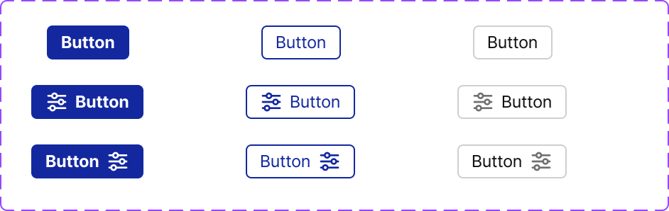

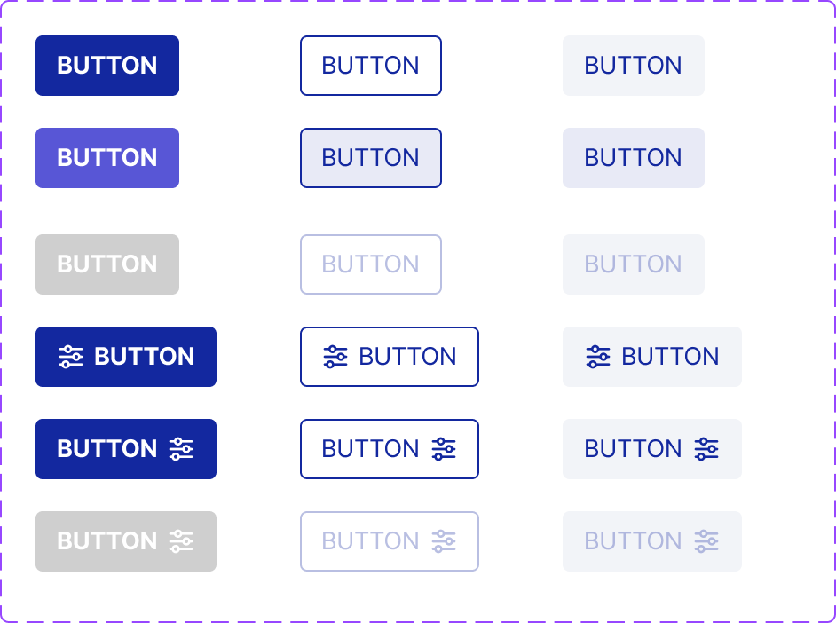

- **상·하 패딩 0:** 위아래로 별도 패딩을 주지 않는다. 대신 **`min-height`(또는 `height`)를 위 표와 동일하게 고정**하고, 내부를 **`display: inline-flex` 또는 `flex` + `align-items: center` + `justify-content: center`** 로 채워 텍스트·아이콘을 수직·수평 중앙에 둔다.
- **짧은 라벨:** 라벨이 매우 짧을 때 **`min-width: 60px`**(Medium 기준)을 둔다. §3.8 `.btn-ds`와 동일.
- **표 vs 참조 구현:** §3.1 표는 **목표 스펙**(Small 24px·좌우 10px 등). §3.8 `.btn-ds`는 **높이 34px·`padding: 7.5px 12px`** 로 표와 다르다. 정리 시 표에 맞추거나 Small 전용 클래스를 추가한다.

### 3.2 너비 (2가지)

- **콘텐츠·패딩 기준 (Hug):** 기본은 `width: auto`. 라벨 길이·아이콘 유무에 따라 너비가 결정되며, 좌우에는 §3.1의 패딩만큼만 여백이 붙는다.
- **전체 폭:** 폼 하단·모달 푸터 등에서 **한 줄을 꽉 채워야 하면 `width: 100%`** 를 쓴다. 이때도 §3.1의 좌우 패딩·고정 높이·타입별 색 규칙은 그대로 적용한다.

### 3.3 타입·스타일 (3종) — Primary / Black / White 토큰만

버튼의 **배경·글자·테두리·비활성**은 모두 **Primary, Black, White 토큰 family** 안에서만 조합한다 (§1). 컴포넌트 CSS에 **HEX·`rgb()` 숫자 리터럴을 직접 쓰지 않는다.**

아래 세 타입은 이름을 **1st / 2nd / 3rd** 로 부른다(구현 시 클래스·토큰 이름에 그대로 써도 된다).

#### 3.3.1 1st — 솔리드 주요 버튼

- **용도:** 저장, 확인, 로그인 등 화면에서 **가장 중요한 한 가지 행동**에 쓴다. 한 화면에 여러 개를 나란히 두지 않는 것이 일반적이다.
- **Default:** 배경 **`--color-primary`**, 글자·아이콘 **`--color-white-100`**, **굵기 Bold**. 테두리는 없거나 배경과 동일하게 두어 윤곽이 끊기지 않게 한다.
- **Hover:** 배경만 **`--color-primary-hover`** 로 바꾼다. 글자·아이콘은 흰색 유지. 포인터 커서(`cursor: pointer`)는 활성 상태에서만.
- **Disabled:** 클릭 불가(`pointer-events: none` 또는 `disabled` 속성). 배경은 **Black 계열의 옅은 불투명 면**으로 둔다 — 예: **`--color-black-100`에 낮은 불투명도**를 주거나, **`--color-black-20`**에 가까운 단색 면으로 `:root`에 토큰을 정의해 쓴다. 글자·아이콘은 **`--color-white-100`** 을 유지해 “채워진 칩” 형태로 읽히게 한다. 시각적으로는 **채도가 낮고 눌린 느낌**이면 된다.

#### 3.3.2 2nd — 라인(아웃라인) 보조 버튼

- **용도:** 취소 옆의 보조 확인, “다음 단계” 등 **주요 버튼보다 한 단계 약한** 행동.
- **Default:** 배경 **`--color-white-100`** 또는 **`--color-bg-white`**. 테두리는 **1px 실선**, 색 **`--color-primary`** 또는 **`--color-border-primary`**(둘 다 Primary 계열). 글자·아이콘 **`--color-primary`**, **굵기 Regular**.
- **Hover:** 배경을 **`--color-primary-10`**(`--color-primary-bg`와 같은 계열)로 채운다. 테두리 색과 글자 색은 Default와 동일하게 유지해, “흰 바탕에서 살짝 올라온 Primary 틴트”로 보이게 한다.
- **Disabled:** 배경·테두리·글자의 **색 조합은 Default와 동일**하게 두고, **버튼 루트 요소 전체에 불투명도를 낮춘다**(구현 표준: **`opacity: 0.3`** 또는 동일한 시각적 약화를 내는 방식 하나로 프로젝트 전체 통일). 이렇게 하면 테두리·글자가 함께 흐려져 비활성임이 분명해진다.

#### 3.3.3 3rd — 옅은 면(소프트) 보조 버튼

- **용도:** 툴바·필터 줄 등 **밀도 높은 UI**에서 덜 부담스러운 액션.
- **Default:** 배경은 **아주 연한 면**이다. §3.8 참조 구현은 **`--color-bg-subtle`** (`#f2f4f8`, §1.13). 글자·아이콘 **`--color-primary`**, **Regular**. **외곽 테두리는 두지 않는다**(구분은 배경 톤 차이로만).
- **Hover:** 배경을 **`--color-primary-10`** 으로 맞추거나 한 단계 진하게 해서, Default보다 **Primary 성분이 조금 더 보이게** 한다. 글자색은 `--color-primary` 유지.
- **Disabled:** 배경색은 **Default와 동일**하게 유지한다. 대신 **글자와 아이콘이 들어 있는 내부 래퍼만 불투명도를 낮춘다**(예: **`opacity: 0.3`**) — 배경 면은 그대로 두어 2nd Disabled(전체 흐림)와 구분된다.

### 3.4 타이포그래피 (사이즈별)

| 사이즈 | 1st (Bold) | 2nd / 3rd (Regular) |
|--------|------------|---------------------|
| Medium | **14px** | **14px** |
| Small | **12px** | **12px** |

- **줄 높이:** 고정 높이 안에서 잘리지 않도록 **`line-height`는 1 또는 글자 크기에 맞는 단일 줄**로 둔다(여러 줄 라벨이 필요하면 별도 “텍스트 버튼” 패턴으로 분리한다).
- **폰트:** §2 **Pretendard** (`var(--font-pretendard)`).

### 3.5 아이콘

- **위치:** 라벨 **앞(leading)** 또는 **뒤(trailing)** 에 둘 수 있다. 한 버튼에 아이콘은 하나만 둔다.
- **간격:** 아이콘과 라벨 사이 **`gap: 6px`** — §3.8 `.btn-ds`와 동일.
- **크기:** Material Symbols는 라벨과 **같은 `font-size`** 로 두고 `line-height: 1`·flex 정렬로 맞춘다. Medium **14px**면 아이콘 **14px**(필요 시 **18px**까지). Small **12px**면 **12px~16px** 범위에서 통일.
- **색:** 버튼에 `color`를 타입별 글자 토큰으로 주고, 아이콘은 **`currentColor`** 를 쓰면 상태·타입이 바뀔 때 같이 맞는다.
- **라이브러리:** **§2.3** (Material Symbols Outlined).

### 3.6 모서리(라운드)

- **표준 값:** 모든 버튼의 모서리는 **`border-radius: 4px`** 로 통일한다.
- **토큰과의 관계:** §1.10의 **`--radius-button`** 은 버튼에 쓸 때 **반드시 4px와 동일한 값**으로 둔다. 다른 컴포넌트가 같은 변수를 쓰지 않는다면, 버튼 전용으로 `4px`를 직접 써도 되되 **프로젝트 안에서는 한 가지 방식만** 택한다.

### 3.7 상호작용·접근성

- **포커스(탭·칩 등):** Primary 링 예시:

```css
.filter-tab:focus-visible {
  outline: 2px solid var(--color-primary);
  outline-offset: 2px;
}
```

- **포커스(슬라이드·모달 래퍼):** 아래처럼 **컨테이너 루트**는 윤곽을 제거한다. **실제 `button`·`a`** 에는 위 패턴 또는 Bootstrap 기본 포커스를 유지한다.

```css
.offcanvas:focus,
.offcanvas:focus-visible,
.offcanvas-body:focus,
.offcanvas-body:focus-visible,
.modal:focus,
.modal:focus-visible,
[tabindex]:focus,
[tabindex]:focus-visible {
  outline: none !important;
}
```

- **커서:** 활성 `cursor: pointer`, Disabled `cursor: not-allowed`(§3.8 `.btn-ds`).

### 3.8 참조 구현 — `.btn-ds` (Medium 단일 높이)

**§3.3이 타입·상태(색·호버·비활성)의 정본**이다. 아래는 그에 맞춘 **참조 CSS**다.

- **1st `disabled`:** §3.3.1의 “Black 계열 옅은 면 + 흰 글자”에 맞추기 위해 배경 **`--color-black-60`**, 글자 **`--color-white-100`** 로 둔다(대비는 프로젝트에서 `:root` 토큰으로 미세 조정 가능).
- **2nd `disabled`:** §3.3.2에 따라 **Default 색 조합을 유지한 채 루트에 `opacity: 0.3`**.
- **3rd `disabled`:** §3.3.3에 따라 배경은 Default와 동일. 라벨·아이콘은 **`<span class="btn-ds__in">`** 으로 감싼 뒤 그 요소에만 **`opacity: 0.3`**. 래퍼 없이 구현할 경우 루트 `opacity` 로 근사할 수 있으나 배경까지 흐려져 본문과 완전 동일하지는 않다.

```css
/* ========== 버튼 컴포넌트 — Figma 323-3588 Button/Button-34px ========== */
.btn-ds { display: inline-flex; align-items: center; justify-content: center; gap: 6px; height: 34px; min-width: 60px; padding: 7.5px 12px; border-radius: 4px; font-size: 14px; line-height: 1; font-family: var(--font-pretendard); border: 1px solid transparent; cursor: pointer; box-sizing: border-box; white-space: nowrap; }
/* Type 1st — Primary */
.btn-ds-1st { background: var(--color-primary); color: var(--color-white-100); font-weight: 700; }
.btn-ds-1st:hover { background: var(--color-primary-hover); color: var(--color-white-100); }
.btn-ds-1st:disabled { background: var(--color-black-60); color: var(--color-white-100); cursor: not-allowed; pointer-events: none; }
/* Type 2nd — Outline */
.btn-ds-2nd { background: var(--color-white-100); color: var(--color-primary); font-weight: 400; border-color: var(--color-primary); }
.btn-ds-2nd:hover { background: var(--color-primary-10); color: var(--color-primary); border-color: var(--color-primary); }
.btn-ds-2nd:disabled { opacity: 0.3; cursor: not-allowed; pointer-events: none; }
/* Type 3rd — Tertiary — 라벨·아이콘은 .btn-ds__in 로 감쌀 것 */
.btn-ds-3rd { background: var(--color-bg-subtle); color: var(--color-primary); font-weight: 400; }
.btn-ds-3rd:hover { background: var(--color-primary-10); color: var(--color-primary); }
.btn-ds-3rd:disabled { background: var(--color-bg-subtle); color: var(--color-primary); cursor: not-allowed; pointer-events: none; }
.btn-ds-3rd:disabled .btn-ds__in { opacity: 0.3; }
```

### 3.9 AI·개발 강제 요약

- **금지:** Primary·Black·White 밖 팔레트, 버튼 전용 HEX/`rgb()` 하드코딩.
- **허용:** §1 토큰과 본 절 수치. **Small/Medium × 1st/2nd/3rd × Default/Hover/Disabled × Hug/100%** 는 클래스·컴포넌트로 명시한다.
- **검증:** 본 절 표·§3.8과 실제 CSS를 diff해 **높이·패딩·4px 라운드·상태별 색**이 어긋나지 않는지 확인한다.

---

## 4. Badge & Status Label Rules (뱃지·스테이터스 라벨)

스테이터스 **색상 패밀리**(Green, Red, Blue 등)가 정해진 뱃지·칩은 아래 **3단 토큰 규칙**을 따른다. 구현은 `var(--color-…)` 만 사용한다 (§1.11).

### 4.0 공통 색 규칙 (Status 3단)

| 역할 | CSS 토큰 (패밀리 `{색}` = green / red / blue / cyan / orange / yellow / indigo / purple) |
|------|----------------------------------------------------------------------------------------|
| **배경** (화이트계·옅은 면) | `--color-status-white-{색}` |
| **테두리** 1px solid (Light) | `--color-status-light-{색}` |
| **글자·아이콘·채움 도트** (본색) | `--color-status-{색}` |

- **모서리:** `border-radius: var(--radius-badge)` (§1.10, 4px).
- **폰트:** §2 Pretendard.
- **테두리 생략:** §4.5·§4.6처럼 용도상 칩/테두리가 없는 변형은 명시된 경우만 예외.

#### 4.0.1 중립(그레이) — Status Gray 패밀리 없음

문서·화면에서 **그레이**로 부르는 상태(계획 수립, NA, 전체, 0% 등)는 `--color-status-*` Gray가 없으므로 **Black 스케일**로 맞춘다.

| 역할 | 토큰 |
|------|------|
| 배경 | `--color-black-10` (또는 더 옅게 `--color-black-4`) |
| 테두리 | `--color-black-10` |
| 글자·아이콘·도트 | `--color-text-muted` (`--color-black-60` 계열) 또는 맥락에 따라 `--color-black-40` |

---

### 4.1 점검계획 스테이터스 (아이콘 + 라벨)

**용도:** 점검 계획 목록·상세에서 계획 단계 표시.  
**구성:** **Material Symbols Outlined** 아이콘(상태에 맞게 선택) + 한글 라벨.  
**레이아웃:** 높이 **22px** 수준, `padding` 약 **10px 4px**, 아이콘 컨테이너 **14×14px**, 아이콘·텍스트 **gap 5px**, 라벨 **12px Regular**. `display: inline-flex; align-items: center;`.

| 라벨(예) | 의미 색 | 배경 | 테두리 | 글자·아이콘 |
|----------|---------|------|--------|-------------|
| 계획 수립 | 그레이(중립) | §4.0.1 배경 | §4.0.1 테두리 | §4.0.1 글자·아이콘 |
| 진행중 | 블루 | `--color-status-white-blue` | `--color-status-light-blue` | `--color-status-blue` |
| 점검완료 | 그린 | `--color-status-white-green` | `--color-status-light-green` | `--color-status-green` |
| 점검오류 | 레드 | `--color-status-white-red` | `--color-status-light-red` | `--color-status-red` |

**시각 참고:** 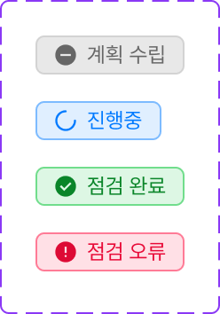

---

### 4.2 점검결과 스테이터스 (6px 도트 + 라벨)

**용도:** 점검 결과 요약·필터 등 위험도/판정과 별도의 **결과 상태** 표시.  
**구성:** 원형 도트 **직경 6px**(`border-radius: 50%`, 배경 = 본색 토큰) + 라벨.  
**레이아웃:** 행 높이 **22px** 수준, `padding` 약 **10px 4px**, **gap 5px**, 라벨 **12px Bold**. 칩 형태(배경·테두리)는 §4.0 표를 따른다.

| 라벨 | 의미 색 | 배경 | 테두리 | 글자·도트 |
|------|---------|------|--------|-----------|
| 양호 | 그린 | `--color-status-white-green` | `--color-status-light-green` | `--color-status-green` |
| 취약 | 레드 | `--color-status-white-red` | `--color-status-light-red` | `--color-status-red` |
| 인터뷰 | 오렌지 | `--color-status-white-orange` | `--color-status-light-orange` | `--color-status-orange` |
| 예외 | 블루 | `--color-status-white-blue` | `--color-status-light-blue` | `--color-status-blue` |
| NA | 그레이 | §4.0.1 배경 | §4.0.1 테두리 | §4.0.1 글자·도트 |

**시각 참고:** 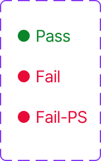

---

### 4.3 위험도 (6px 도트 + 라벨)

**용도:** High / Medium / Low 위험 구분.  
**구성·크기:** §4.2와 동일 (**6px** 도트, **22px** 행·패딩·gap·12px Bold 권장).  
**색:**

| 라벨 | 배경 | 테두리 | 글자·도트 |
|------|------|--------|-----------|
| High | `--color-status-white-red` | `--color-status-light-red` | `--color-status-red` |
| Medium | `--color-status-white-orange` | `--color-status-light-orange` | `--color-status-orange` |
| Low | `--color-status-white-yellow` | `--color-status-light-yellow` | `--color-status-yellow` |

**시각 참고:** 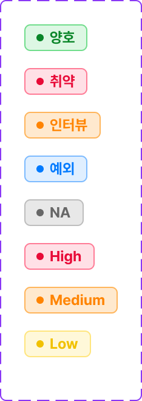

---

### 4.4 결제·신청 현황 칩 (텍스트만)

**두 가지 높이:** **18px** 변형 / **22px** 변형. 모두 §4.0 색 3단을 적용한다.  
**레이아웃 (18px / 22px 변형):**

| 변형 | 고정 높이 | 좌우 패딩(참고) | 글자 |
|------|-----------|-----------------|------|
| **18px** | **18px** | 약 **7px**, 상하 **3px** | **10px Bold** |
| **22px** | **22px** | 약 **10px** | **12px Bold** |

**라벨·색·높이 조합:**

| 라벨 | 18px | 22px | 의미 색 | 배경 | 테두리 | 글자 |
|------|:----:|:----:|---------|------|--------|------|
| 완료 | O | O | 그린 | `--color-status-white-green` | `--color-status-light-green` | `--color-status-green` |
| 반려 | O | O | 레드 | `--color-status-white-red` | `--color-status-light-red` | `--color-status-red` |
| 결재중 | O | O | 인디고 | `--color-status-white-indigo` | `--color-status-light-indigo` | `--color-status-indigo` |
| 전체 | O | O | 그레이 | §4.0.1 배경 | §4.0.1 테두리 | §4.0.1 글자 |
| 등록 | — | **O** | 블루 | `--color-status-white-blue` | `--color-status-light-blue` | `--color-status-blue` |
| 수정 | — | **O** | 오렌지 | `--color-status-white-orange` | `--color-status-light-orange` | `--color-status-orange` |
| 삭제 | — | **O** | 레드 | `--color-status-white-red` | `--color-status-light-red` | `--color-status-red` |

**시각 참고:**

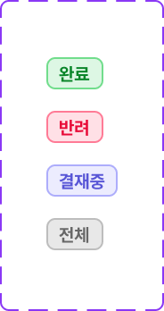

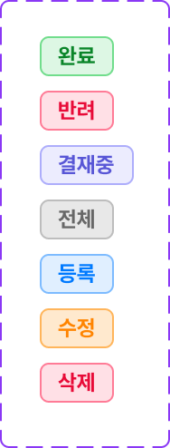

---

### 4.5 그래프 수치 (변동률 칩)

**용도:** 차트·카드에서 **전기 대비 %** 등을 짧게 표시.  
**레이아웃 (수치 칩, 16px 라인 기준):** 한 줄 높이 약 **16px**, `padding` 약 **6px 2px**, 아이콘·숫자 **gap 2px**, 숫자 **10px Bold**, `border-radius: 4px`. **테두리는 두지 않는다**. 배경만 옅은 Status 면 + 아이콘·숫자는 본색.

| 표현 | 아이콘·기호 | 의미 색 | 배경(옅은 면) | 글자·아이콘 |
|------|-------------|---------|---------------|-------------|
| 하락 + 음수% (예: -5%) | 하락 추세 아이콘 | 그린 | `--color-status-white-green` | `--color-status-green` |
| 상승 + 플러스% (예: +5%) | 상승 추세 아이콘 | 레드 | `--color-status-white-red` | `--color-status-red` |
| 중앙선 + 0% | 가로 중립선(—) | 그레이 | `--color-black-10` | `--color-black-40` (선·숫자 동일) |

> **의미:** “수치 **하락** = 긍정” 맥락에 맞춰 하락·음수는 **그린**, 상승·플러스는 **레드**로 고정한다. 제품 정책이 바뀌면 본 표만 수정한다.

**시각 참고:** 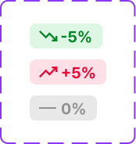

---

### 4.6 점검결과 Pass / Fail / Fail-PS (10px 도트 + 라벨, 무칩)

**용도:** 상세·표 안에서 **영문 결과**를 도트와 함께 표시한다.  
**구성:** **배경·테두리 없음** — 행/셀 배경 위에만 올린다. **도트 직경 10px**, 본색 채움. 라벨 **14px Regular**, `line-height: 20px`, **gap 5px**.

| 라벨 | 색(도트·글자 동일) |
|------|---------------------|
| Pass | `--color-status-green` |
| Fail | `--color-status-red` |
| Fail-PS | `--color-status-red` (Fail과 동일 팔레트, **라벨 문자열만** 구분) |

---

### 4.7 업무 상태 뱃지 매핑 (Bootstrap 호환)

아래 표는 운영 화면에서 반복 사용되는 상태 라벨을 **Bootstrap 배지 클래스 기준**으로 고정한 매핑이다. Bootstrap 클래스는 구현 참조용이며, 실제 색상은 §1 토큰 체계를 우선한다.

#### 4.7.1 운영상태 (E28)

| 상태 | 의미 색 | Bootstrap 클래스 |
|------|---------|------------------|
| 대기 | 회색(중립) | `badge bg-secondary` |
| 활성 | 녹색 | `badge bg-success` |
| 비활성 | 빨간색 | `badge bg-danger` |

#### 4.7.2 점검 도출상태 (E12)

| 상태 | 의미 색 | Bootstrap 클래스 |
|------|---------|------------------|
| 작성중 | 회색(중립) | `badge bg-secondary` |
| 대기 | 파란색 | `badge bg-primary` |
| 진행중 | 주황색 | `badge bg-warning text-dark` |
| 완료 | 녹색 | `badge bg-success` |

#### 4.7.3 결과/조치 도출상태 (E16, E29)

| 상태 | 의미 색 | Bootstrap 클래스 |
|------|---------|------------------|
| 임시저장 | 회색(중립) | `badge bg-secondary` |
| 등록/제출됨 | 파란색 | `badge bg-primary` |
| 검토완료 | 녹색 | `badge bg-success` |
| 조치중 | 주황색 | `badge bg-warning text-dark` |
| 조치완료 | 진녹색 | `badge bg-success` |
| 제외 | 연회색 | `badge bg-light text-dark` |

#### 4.7.4 검토 판정 (S-07)

| 판정 | 의미 색 | Bootstrap 클래스 |
|------|---------|------------------|
| 적합 | 녹색 | `badge bg-success` |
| 미흡 | 주황색 | `badge bg-warning text-dark` |
| 부적합 | 빨간색 | `badge bg-danger` |
| 예외수용 | 하늘색 | `badge bg-info` |
| 예외미수용 | 연빨간색 | `badge bg-danger bg-opacity-75` |

#### 4.7.5 결재상태 (E25, S-10)

| 상태 | 의미 색 | Bootstrap 클래스 |
|------|---------|------------------|
| 미상신 | 회색(중립) | `badge bg-secondary` |
| 대기 | 파란색 | `badge bg-primary` |
| 승인 | 녹색 | `badge bg-success` |
| 반려 | 빨간색 | `badge bg-danger` |

#### 4.7.6 도메인 (B~F)

| 도메인 | 의미 색 | Bootstrap 클래스 |
|--------|---------|------------------|
| B (단말) | 파란색 | `badge bg-primary` |
| C (위수탁) | 보라색 | `badge bg-purple` (커스텀) |
| D (IT) | 초록색 | `badge bg-success` |
| E (내부) | 주황색 | `badge bg-warning text-dark` |
| F (외주) | 빨간색 | `badge bg-danger` |

#### 4.7.7 점검구분

| 구분 | 의미 색 | Bootstrap 클래스 |
|------|---------|------------------|
| 정기 | 파란색 | `badge bg-primary` |
| 상시 | 녹색 | `badge bg-success` |
| 외부감독 | 보라색 | `badge bg-purple` (커스텀) |

#### 4.7.8 변경 이력 구분

| 구분 | 의미 색 | Bootstrap 클래스 |
|------|---------|------------------|
| 등록 | 녹색 | `badge bg-success` |
| 수정 | 파란색 | `badge bg-primary` |
| 삭제 | 빨간색 | `badge bg-danger` |

#### 4.7.9 기타 뱃지

| 뱃지 | 스타일 | 용도 |
|------|--------|------|
| 재제출 | `badge border border-warning text-warning` | 주황색 아웃라인 강조 |
| 예외요청 | `badge border border-info text-info` | 하늘색 아웃라인 강조 |
| 필수 | `<span class="text-danger">*</span>` | 필수 항목 마커 |

---

### 4.8 AI·개발 강제 요약

- **금지:** 뱃지 단에서 임의 HEX/`rgb()` — §1.13·§4 토큰만 사용.
- **허용:** 패밀리별 **White / Light / 본색** 조합, 중립은 §4.0.1 Black 스케일.
- **검증:** 구현 산출물의 `.badge-inspection`, `.badge-application` 등이 본 절과 어긋나면 **토큰·클래스를 본 절 기준으로 정렬**한다.

---

## 5. Text Input & Dropdown Field Rules (인풋·드롭다운 필드)

텍스트 필드는 **일반 / 필터용 / 검색용** 세 종류다. 색·테두리는 **`var(--color-…)` 만** 쓴다 (§1.11).

### 5.0 세 종 공통 — 디폴트 베이스

| 속성 | 규칙 |
|------|------|
| **배경** | **`--color-white-100`** (또는 **`--color-bg-white`**) |
| **테두리** | **`1px solid var(--color-black-40)`** (Black 40%) |
| **폰트** | Pretendard, §2 |

인풋 **종류별로 달라지는 것**만 아래 절에 적는다. Disabled·Completed Disabled 등 **예외 면색**이 있으면 해당 행을 따른다.

### 5.0.1 필드 제목 라벨 — 배치

필드 제목(라벨)이 붙을 때 **인풋·드롭다운 트리거와의 상대 위치**는 아래만 쓴다.

| 구분 | 레이아웃 | 설명 |
|------|----------|------|
| **일반·검색** (및 폼에서 동일 패턴을 쓰는 필드) | **라벨 위 → 필드 아래** | 라벨이 **위**에 오고, 인풋 또는 드롭다운 필드가 **그 아래**에 온다(세로 스택). 검색 필드가 라벨 없이 단독으로 쓰이는 경우는 예외. |
| **필터** | **라벨 앞 → 필드 뒤 (가로)** | 라벨이 **왼쪽(앞)**에 오고, 인풋·드롭다운이 **오른쪽(뒤)**에 온다. **한 줄 가로 정렬**(`display: flex` / `inline-flex`, `flex-direction: row`, **`align-items: center`**)과 라벨·필드 사이 **일정 gap**으로 맞춘다. |

라벨 타이포·색은 §2·§1 텍스트 토큰을 따르고, **필터 행**에서도 라벨만 세로 중앙 기준으로 필드 높이(40px)와 맞춘다.

---

### 5.1 일반 인풋 (General)

라벨이 있으면 **§5.0.1** — 라벨 **위**, 필드 **아래**.

**레이아웃 (참고):** 높이 **44px**, 좌우 패딩 **15px**, **`border-radius: 5px`**, 본문·플레이스홀더 **16px Regular**. 값 입력 후 지우기가 있으면 트레일링 클리어 아이콘(예: **18px** 영역)을 둘 수 있다. 셀렉트(드롭다운 트리거) 변형은 우측 **24px** 영역에 쉐브론을 둔다.

| 상태 | 배경 | 테두리 | 글자·비고 |
|------|------|--------|-----------|
| **Default** | 흰색 (§5.0) | **`--color-black-40`** | 플레이스홀더 **`--color-black-40`**, 본문 입력 전과 동일 톤 허용 |
| **Disabled** | **`--color-black-10`** (`rgba` 스케일과 동일 계열) | **`--color-black-40`** | **`--color-black-20`** 계열로 저대비 |
| **Completed** (값 있음) | 흰색 | **`--color-black-40`** | 값 **`--color-text-primary`**, 클리어 버튼 가능 |
| **Focused** | 흰색 | **`--color-primary`** | 포커스 링·테두리만 Primary, 글자는 보통 **`--color-text-primary`** |
| **Error** | 흰색 | **`--color-status-red`** | 필드 값은 **`--color-text-primary`**, 하단 도움말(있으면) **11px Regular** + **`--color-status-red`**, 우측 경고 아이콘 가능 |
| **Completed Disabled** | **`--color-bg-base`** | **`--color-black-40`** | 값 **`--color-text-primary`**, **Regular** — 읽기 전용·비활성 확정값 |

**시각 참고:** 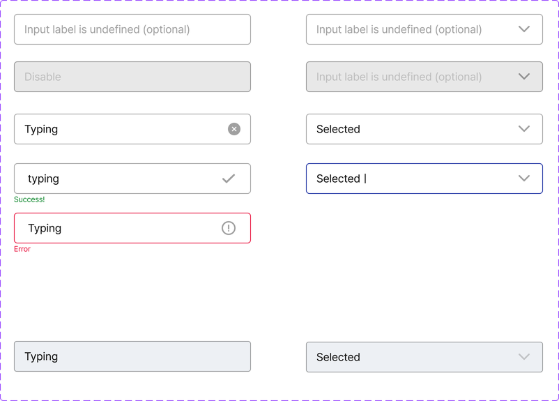

---

### 5.2 필터 인풋 (Filter)

**레이아웃 (참고):** 높이 **40px**, 좌우 패딩 **15px**, **`border-radius: 5px`**, **14px**, `line-height: 20px`, 자간 **-0.01em** 수준(디자인과 동기화). 필터에 라벨이 있으면 **§5.0.1 필터 행(가로)** 을 따른다.

| 상태 | 배경 | 테두리 | 글자·비고 |
|------|------|--------|-----------|
| **Default** | 흰색 (§5.0) | **`--color-black-40`** | 플레이스홀더 **`--color-black-40`**, **Regular** |
| **Disabled** | **`--color-black-10`** | **`--color-black-40`** | 라벨 톤 **`--color-black-40`**, **Regular** |
| **Completed** (필터 값 적용됨) | 흰색 | **`--color-primary`** | 표시 값 **`--color-text-primary`**, **Bold(700)** |
| **Completed Disabled** | **`--color-bg-base`** | **`--color-black-40`** | 값 **`--color-text-primary`**, **Regular** |

셀렉트 트리거(On) 변형도 **상태별 테두리·면 규칙은 위와 동일**하게 맞춘다.

**시각 참고:** 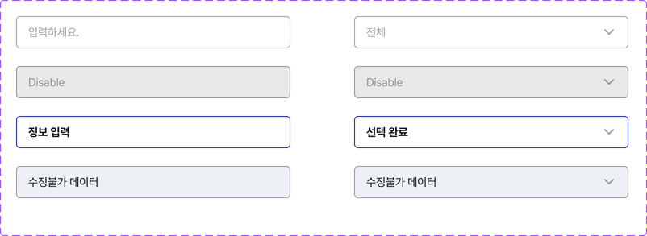

---

### 5.3 검색 인풋 (Search) — 페이지·툴바 등 단독 필드

라벨이 붙는 검색 필드는 **§5.0.1** — 라벨 **위**, 검색 필드 **아래**. 라벨 없는 단독 배치는 흔함.

**레이아웃 (참고):** 높이 **32px**, 좌우 패딩 **10px**·상하 **2px**, **`border-radius: 4px`**, **14px Regular**, `line-height: 20px`. 우측 검색 아이콘 **16px** 영역.

| 상태 | 배경 | 테두리 | 글자·비고 |
|------|------|--------|-----------|
| **Default** | 흰색 (§5.0) | **`--color-black-40`** | 플레이스홀더 **`--color-black-40`**, 검색 아이콘 **`--color-black-60`** 계열 허용 |
| **Type text** (포커스·입력 중) | 흰색 | **`--color-primary`** | 입력 값 **`--color-text-primary`**, 클리어(예: **12px**) + 검색 아이콘 트레일링, **gap 5px** |

**시각 참고:** 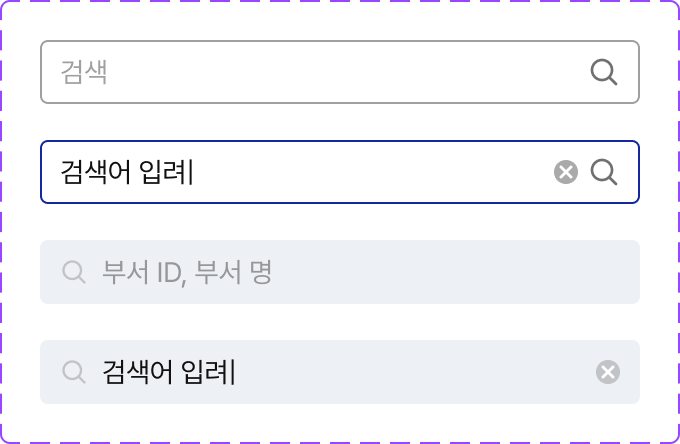

---

### 5.4 드롭다운 메뉴 패널 & 패널 내 검색 행

- **패널(옵션 리스트를 감싸는 박스):** 옵션·라벨의 **글꼴 크기는 트리거 필드와 동일**하게 맞춘다. **배경은 흰색**, **테두리는 `1px solid var(--color-black-40)`** — §5.0 디폴트 베이스와 동일한 면·선이다.
- **패널 안 “검색어 입력” 행 (Search fields in the drop-down menu):**
  - 행 배경 **`--color-bg-base`** (페이지 베이스와 동일 톤).
  - **테두리 없음** (`border: none` / `border-color: transparent`) — Default·입력 중·포커스 모두 **외곽선 없음**.
  - 플레이스홀더 **`--color-black-40`**, 입력 텍스트 **`--color-text-primary`**, **14px Regular**. 좌측 검색 아이콘(**14px** 영역), 텍스트와 **gap 7px**. 입력 중에는 우측 클리어(**12px**) 가능.

**시각 참고 (검색 가능한 드롭다운·패널):** 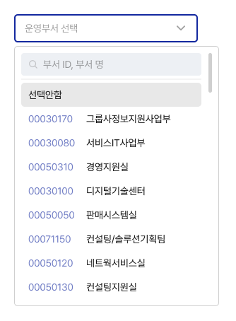 — §10.4와 동일 패턴.

---

### 5.5 AI·개발 강제 요약

- **금지:** 인풋·드롭다운에 브랜드·상태색을 HEX/`rgb()`로 직접 박기 — §1·본 절 토큰만.
- **허용:** §5.0 공통 + 종류별 상태 표의 **`--color-primary`**, **`--color-black-*`**, **`--color-status-red`**, **`--color-bg-base`** 조합.
- **검증:** 동일 화면에서 일반·필터·검색이 **서로 다른 테두리 규칙을 섞어 쓰지 않는지**, 라벨이 **§5.0.1** 과 맞는지(일반=세로, 필터=가로), 드롭다운 패널이 §5.4 면·선·타이포를 따르는지 확인한다.

---

## 6. Radio, Checkbox & Toggle Rules (라디오·체크박스·토글)

선택·토글 컨트롤의 **선택됨·켜짐(On) 등 액티브 면·채움·강조 테두리**는 **`--color-primary`** 를 쓴다 (§1). 구현은 **`var(--color-…)` 만** (§1.11).

### 6.1 라디오 버튼 (박스형: 컨트롤 + 라벨)

**형태:** 라디오 도트와 텍스트를 **하나의 박스**로 묶는다. `inline-flex` / `flex` 로 **가로 배치**, **`align-items: center`**, 도트·라벨 **`gap: 7px`**.

| 상태 | 박스 배경 | 박스 테두리 | 도트(16×16 영역) | 라벨 텍스트 |
|------|-----------|-------------|------------------|-------------|
| **ON (선택)** | **`--color-primary-10`** 계열 옅은 틴트(디자인상 라벤더 틴트와 동일 역할) | **`2px solid var(--color-primary)`** | 바깥 원 **`--color-primary`** 스트로크, 안쪽 채움 점 **`--color-primary`** | **`--color-text-primary`**, **14px Regular**, `line-height: 20px` |
| **OFF** | **`--color-white-100`** | **`1px solid var(--color-black-40)`** (#aaa 계열 중립선과 동일 역할) | 비선택 원형 — **외곽 링 `var(--color-primary)`**, 내부 **비채움(흰)** | **`--color-text-primary`**, **14px Regular** |
| **Disabled** | **`--color-bg-subtle`** (또는 `#ebeef3` 에 맞춘 전용 토큰으로 통일) | **`1px solid var(--color-black-40)`** | 비활성 원형(채움 없음), 스트로크 **`--color-black-40`** | **`--color-black-40`** 또는 **`--color-text-muted`**, **14px Regular** |

**박스 치수 (참고):** **`min-width: 70px`**, 좌우 **`padding: 12px`**, 상하 **`10px`**, **`border-radius: 4px`**. 라디오 그룹은 옵션마다 동일 박스 규칙을 반복한다.

**시각 참고:** 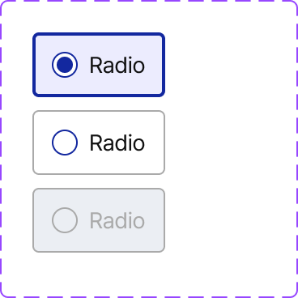 · 

---

### 6.2 체크박스 (아이콘만, 16×16 기준)

**공통:** 한 변 **16px**, **`border-radius: 2px`**. 액티브(선택·부분선택) **면색은 `var(--color-primary)`**.

| 상태 | 배경 | 테두리 | 내부 그래픽 |
|------|------|--------|-------------|
| **UnCheck** | **`--color-white-100`** | **`1px solid var(--color-black-60)`** | 없음 |
| **Check** | **`--color-primary`** | 없음(면이 곧 영역) | **흰색** 체크 마크 |
| **Partial** (indeterminate) | **`--color-primary`** | 없음 | **흰색** 가로 막대(중앙); 컴포넌트 전체에 **`opacity: 0.5`** 를 적용해 부모·자식 일관되게 반투명 처리 |
| **Disabled** | **`#d8dde2`** 계열 단색 면 — **`--color-black-20`** 단색으로 근사하거나 `:root`에 **비활성 체크박스 면** 토큰으로 고정 | 없음 | **회색조** 체크 마크(가독 유지) |
| **Disabled (No data)** | **`--color-white-100`** | **`1px solid var(--color-black-40)`** (#aaa 계열과 동일 역할) | 없음 — 데이터 없음·선택 불가 표시 |

라벨이 붙으면 **§5.0.1** 과 맞춘다(일반 폼이면 라벨 위·필드 아래, 필터 행이면 가로).

**시각 참고:** 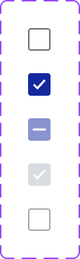

---

### 6.3 토글 (스위치, On / Off)

**치수 (참고):** 트랙 **가로 28px × 세로 16px**, **캡슐형** (`border-radius` 큰 값, 예: **100px**). 썸(핸들)은 **흰 원**, 트랙 안에서 좌우 이동.

| 상태 | 트랙(배경) | 썸 |
|------|------------|-----|
| **On** | **`--color-primary`** | **`--color-white-100`**, 트랙 **오른쪽** 정렬 |
| **Off** | **`--color-black-20`** (Black 20% 면) | **`--color-white-100`**, **`1px solid var(--color-black-40)`** 테두리(중립 윤곽 — On/Off 비텍스트 대비 혼동 완화, WCAG 1.4.11 검토 시 조정), 트랙 **왼쪽** 정렬 |

접근성: `role="switch"` / `aria-checked`, 키보드 포커스 시 **§3.7** 포커스 링 패턴을 따른다.

**시각 참고:** 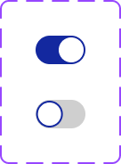

---

### 6.4 AI·개발 강제 요약

- **금지:** 선택·On 상태에 Primary 대신 임의 HEX, 체크박스만 예외 없이 다른 브랜드색.
- **허용:** 액티브 = **`--color-primary`**(및 필요 시 **`--color-primary-10`** 박스 틴트), 비활성·중립 = **`--color-black-*`**, **`--color-bg-subtle`**, **`--color-white-100`**.
- **검증:** 라디오 박스의 **2px / 1px 테두리** 전환이 상태표와 일치하는지, 체크 **Partial** 에 **`opacity: 0.5`** 가 빠지지 않았는지, 토글 **Off** 썸의 **`--color-black-40` 1px 테두리**가 유지되는지 확인한다.

---

## 7. Grid & Page Layout (그리드·페이지 레이아웃)

### 7.1 그리드 시스템 — Bootstrap

- **열·행·브레이크포인트**는 **Bootstrap 그리드**(`container` / `container-fluid`, `row`, `col-*`, `g-*` 등)를 쓰고, **해당 버전 문서의 규칙**(12열, 반응형 접두사, 네거티브 마진·gutter 동작)을 따른다.
- 커스텀 그리드를 새로 짜서 Bootstrap과 **충돌하지 않게** 한다. 필요 시 `row`·`col` 조합으로만 확장하고, 임의 `float`·퍼센트 열로 그리드를 대체하지 않는다.

### 7.2 섹션 간격·페이지·콘텐츠 패딩

| 구분 | 기준값 | 설명 |
|------|--------|------|
| **섹션 ↔ 섹션** | **`20px`** | 화면 안에서 의미 있는 블록(섹션) 사이 세로(또는 스택 방향) 간격. `margin`·`gap` 등으로 **20px**를 기본으로 맞춘다. |
| **메인 콘텐츠 패딩(영역)** | **`40px`** | 페이지·레이아웃에서 **본문이 차지하는 메인 영역**의 바깥 여백(뷰포트 또는 레이아웃 셸 대비 **좌우·상하 인셋**). GNB·사이드바 등 고정 뼈대 **안쪽**으로 들어오는 “큰 틀”의 패딩 기준이다. |
| **콘텐츠 내부 패딩** | **`20px`** (기본) | 카드·패널·표 컨테이너 등 **블록 안쪽** 여백의 **일반 기본값**. |

**가변성:** 콘텐츠 내부 패딩은 **밀도·컴포넌트·모바일**에 따라 **20px보다 작거나 클 수 있다**. 이때는 **해당 화면·컴포넌트에서 일관되게**만 조정하고, 문서 기본값(20px / 40px / 섹션 gap 20px)과 **동시에 깨지지 않게** 우선순위를 정한다(예: 좁은 서브패널은 16px, 풀블리드 테이블은 좌우 0 등 — **의도적으로 예외인 경우만**).

### 7.3 화면 유형별 블록 순서 (콘텐츠 영역)

아래는 **GNB·LNB 안쪽 본문**에 쌓는 **블록 순서** 참고다. 화면 코드(A-01 등)는 **예시**이며, 실제 메뉴에 맞게 줄이거나 바꾼다. **§10 필터**, **§12 요약 포틀릿**, **§17 안내 배너**, **§18 빈/에러** 와 연결한다.

**목록 화면** (예: A-01, A-03, B-01, G-02, S-02)

```
┌─────────────────────────────────────┐
│ [알림 배너] ⓘ 안내 메시지...       × │  ← 선택 (필요 시, §17)
├─────────────────────────────────────┤
│ [요약 포틀릿] 카드1│카드2│카드3    ∧/∨│  ← 선택 (필요 시, §12)
├─────────────────────────────────────┤
│ ▼Filter ② │태그1 ×│태그2 ×│  ↺초기화│  ← 필터 많을 때 (§10.1)
│  또는                                │
│ 인라인 검색 [검색][초기화]             │  ← 필터 적을 때
├─────────────────────────────────────┤
│ 전체 N건                             │
│ 버튼 영역                            │
│ [등록] [삭제] [엑셀 다운로드]          │
├─────────────────────────────────────┤
│ 테이블 영역                          │
│ ☐ │컬럼1│컬럼2│컬럼3│컬럼4│...       │
│ ──┼────┼────┼────┼────┼──          │
│ ☐ │데이터│데이터│데이터│데이터│...       │
├─────────────────────────────────────┤
│ 페이징                               │
│        ◀ 1 2 3 4 5 ▶               │
└─────────────────────────────────────┘
```

**등록/수정 화면** (예: A-02, A-04, B-02, S-03)

```
┌─────────────────────────────────────┐
│ 화면 제목                    [브레드크럼]│  ← §14
├─────────────────────────────────────┤
│ 기본 정보 영역                        │
│ ┌────────┬──────────────────┐      │
│ │ 라벨    │ 입력 필드          │      │
│ │ 라벨    │ 입력 필드          │      │
│ └────────┴──────────────────┘      │
├─────────────────────────────────────┤
│ 상세 영역 (테이블 또는 추가 폼)        │
├─────────────────────────────────────┤
│ 버튼 영역                            │
│ [저장] [삭제] [목록]                  │
└─────────────────────────────────────┘
```

**대시보드 화면** (예: S-04, G-01, I-01)

```
┌─────────────────────────────────────┐
│ 화면 제목                    필터 영역 │
├────────┬────────┬────────┬─────────┤
│ 카드 1  │ 카드 2  │ 카드 3  │ 카드 4   │  ← 기본 4개 (필요 시 증가, §12)
├────────┴────────┴────────┴─────────┤
│ 현황 테이블 / 차트                    │  ← 기본 2개 (필요 시 증가)
├─────────────────────────────────────┤
│ 상세 목록 (접기/펼치기)               │
└─────────────────────────────────────┘
```

- **차트:** 대시보드·리포트의 차트는 **문서 상단 「차트 라이브러리 표준」** — **`Chart.js`만** 사용한다. ApexCharts / ECharts / Highcharts 등 **혼용 금지**.

**마스터-디테일 화면** (예: A-11, H-02)

```
┌──────────┬──────────────────────────┐
│ 좌측      │ 우측                      │
│ 트리/목록  │ 상세 정보                  │
│           │                          │
│ ▶ 항목1   │ ┌────────┬────────┐     │
│ ▼ 항목2   │ │ 라벨    │ 필드    │     │
│   ├ 하위1 │ └────────┴────────┘     │
│   └ 하위2 │                          │
└──────────┴──────────────────────────┘
```

### 7.4 전체 앱 프레임 (GNB + LNB + 본문)

**§15 GNB**, **§16 LNB**, **§14 브레드크럼**(세부 페이지)과 **같은 축**으로 본다.

```
┌─────────────────────────────────────────────────────────────────────────┐
│ [GNB]     │ 📋 제목/브레드크럼     │ 날짜 │ 매뉴얼 ▼ │ 사용자 ▼        │
├───────────┼────────────────────────────────────────────────────────────┤
│ [LNB]     │ [콘텐츠 영역 — §7.3 화면 유형별 블록]                            │
│ 메뉴      │                                                            │
│           │                                                            │
└───────────┴────────────────────────────────────────────────────────────┘
```

- 스크린샷·검증용 이미지가 필요하면 **`img/`** 에 두고 **참조 범위**에 맞게 경로만 적는다.

### 7.5 AI·개발 강제 요약

- **금지:** Bootstrap 그리드 없이 임의 퍼센트만으로 페이지 뼈대를 구성해 브레이크포인트와 엇박자 나기; 목록 화면에서 **필터·테이블·페이징** 순서를 화면마다 제각각 바꾸기.
- **허용:** 그리드 = Bootstrap 규칙, **섹션 gap 20px**, **메인 인셋 40px**, **내부 패딩 기본 20px** + 문서화된 예외; §7.3 유형별 블록 순서를 **템플릿 기준**으로 맞춘 뒤 예외만 명시.
- **검증:** 동일 템플릿에서 **메인 40px**와 **카드 내부 20px**가 혼용될 때 시각적 계층이 유지되는지, 섹션 간격이 **20px**에서 무분별하게 벗어나지 않는지, GNB+LNB+본문이 **§15·§16** 과 충돌하지 않는지 확인한다.

---

## 8. Table & Tooltip Rules (테이블·툴팁)

테이블은 **세로형**(페이지 목록 등)과 **가로형**(슬라이드·팝업 요약) 두 타입이다. 색·선은 **`var(--color-…)`** (§1.11).

### 8.0 용도 구분

| 타입 | 주 사용처 |
|------|-----------|
| **세로형** | 페이지 본문에서 **가장 많이 쓰는** 데이터 그리드(행=레코드, 열=필드). |
| **가로형** | **슬라이드·팝업** 안 **요약 정보** (항목명 `th` / 값 `td` 한 쌍이 한 줄 또는 블록). |

---

### 8.1 세로형 테이블

| 속성 | 규칙 |
|------|------|
| **모서리** | **`border-radius: 8px`** (컨테이너·카드 래퍼에 적용). |
| **셀 패딩** | 좌우 **`15px`**, 상하 **`0`** — 세로 정렬은 **`align-items: center`** 등으로 중앙. |
| **본문 글자** | **14px** Regular(열·맥락에 따라 Bold 허용). |
| **외곽 보더** | **`1px solid var(--color-border-panel)`** (`#e2e8f0`, §1.9). |
| **그림자** | **`var(--shadow-table)`** (§1.10·`UX-STANDARD-root.css` — Black **5%** 계열, `var(--color-black-5)` 기반). |

**시각 참고:** 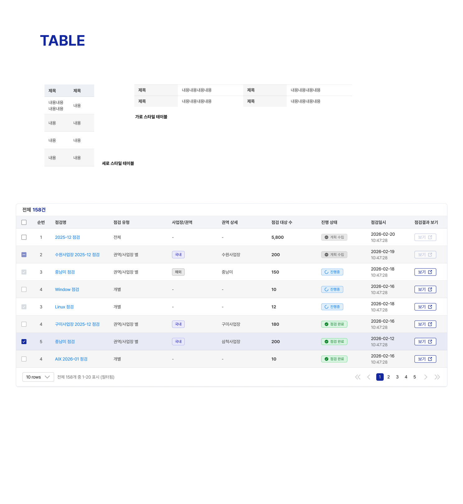

**상단 헤더 바(테이블 위·카드 헤더):**

- 왼쪽: **「전체 {숫자}건」** 형식으로 건수 표기(숫자 강조는 **`--color-primary`** 허용).
- 오른쪽: 필요 시 **버튼·툴바** 배치(`justify-content: space-between` 등).

**`<th>` (컬럼 헤더):**

- **높이 `40px`**, 배경 **`var(--color-bg-subtle)`** (`#f2f4f8`).
- 글자색은 열에 따라 가변 가능, **기본 `var(--color-text-primary)`** (Black 100%).

**`<td>` (본문 셀):**

- **높이 `56px`**(고정 행 기준).
- **얼룩말:** 홀수·짝수 행 교차 — **`--color-white-100`** / **`var(--color-black-4)`** 면 (Black 4%).
- 기본 텍스트 **`var(--color-text-primary)`**.
- **클릭 가능한 텍스트(링크·상세 이동):** **`var(--color-status-blue)`** (§1 — 링크 톤).
- **줄 수:** 기본 **최대 2줄**까지 표시. **3줄 이상은 말줄임**(`-webkit-line-clamp: 2` + `overflow: hidden` 등). 잘린·숨은 내용은 **마우스 오버 시 툴팁(§8.4)** 으로 전체 노출.

내부 뱃지·버튼·체크박스는 **§4·§3·§6** 과 맞춘다.

---

### 8.2 가로형 테이블 (요약)

| 속성 | 규칙 |
|------|------|
| **모서리** | **없음** (`border-radius: 0`). |
| **셀 패딩** | **좌 `15px`**, **상·하·우 `0`** (필요 시 값 셀만 미세 조정은 맥락 내 통일). |
| **글자** | **제목(항목) 14px**, **내용(값) 16px**. |
| **보더·그림자** | **없음**. |
| **상단 “테이블 헤더 바”** | **없음** — 바로 행부터 시작. |

**`<th>` 역할 셀 (왼쪽 라벨):**

- **높이 `36px`**(기본 행), 배경 **Black 5%** — **`var(--color-black-5)`** (§1.13·`UX-STANDARD-root.css`).
- 글자색 가변 가능, **기본 `var(--color-black-80)`**.

**`<td>` 값 셀:**

- **높이 `36px`**를 기본으로 하되, **긴 본문 행은 행 높이가 늘어날 수 있음**(디자인 예제와 동일하게 여러 줄 값 허용).
- 배경 **`--color-white-100`**, 기본 텍스트 **`var(--color-text-primary)`**.
- **클릭 가능 영역:** **`var(--color-status-blue)`**.
- **중요한 값·라벨**은 **Bold(700)** 로 강조할 수 있음.

---

### 8.3 테이블 하단 영역 (세로형)

**적용:** **세로형 테이블** 카드에서 **그리드 본문 바로 아래**에 붙인다(좌·우 끝 정렬, **테이블과 동일 너비**의 한 줄 바). 가로형 요약 테이블에는 **기본 적용하지 않는다**.

**레이아웃:** `display: flex`, **`justify-content: space-between`**, **`align-items: center`**, 좌측 블록·우측 블록이 **각각 영역 끝**에 붙는다. 필요 시 상단에 **`1px solid var(--color-border-panel)`** 로 본문과 구분한다.

#### 왼쪽 영역

1. **페이지당 행 수 드롭다운** — 현재 표시 개수(예: 10·20·50) 선택. 스타일은 **§5.2 필터 인풋**과 같은 토큰 계열(흰 배경, **`1px solid var(--color-black-20)`** 테두리, **14px Regular**, **`border-radius: 4px`**, 좌우 패딩 등)로 맞춘다. 높이는 하단 바에 맞게 **약 30px** 전후로 통일.
2. **범위 문구** — 드롭다운 오른쪽에 **`gap: 10px`** 수준으로 두고, **「전체 {총개수}개 중 {시작}-{끝} 표시」** 형식으로 적는다. 필터 적용 시 **`(필터됨)`** 등 부가 문구를 붙일 수 있다.

#### 오른쪽 영역 — 페이지네이션

**순서(고정):** **`<<`** (첫 페이지) · **`<`** (이전) · **페이지 번호들** · **`>`** (다음) · **`>>`** (마지막)의 형태의 아이콘 사용.

| 항목 | 규칙 |
|------|------|
| **번호 표시 개수** | 한 번에 보이는 **페이지 숫자는 최대 10개**. 11페이지 이상이면 **윈도우를 이동**하며 앞·뒤 구간을 본다(예: 1–10 다음 11–20). |
| **현재 페이지(액티브)** | 배경 **`var(--color-primary)`**, 글자 **`var(--color-white-100)`**, **`border-radius: 5px`**. 치수 참고: **24×24px** 안에 **`padding: 4px 8px`** 로 숫자 중앙. **14px Regular**. |
| **비액티브 번호** | 배경 투명, 글자 **`var(--color-text-primary)`**, **14px Regular**. 인접 번호 **`gap: 4px`**. |
| **앞뒤 화살표** | **24×24px** 터치·클릭 영역, 아이콘 **`--color-black-20`** 계열 등 비활성 톤과 구분 가능하게. 이전·다음 그룹과 **`gap: 12px`**. |

첫/이전이 불가일 때·마지막/다음이 불가일 때는 **disabled·흐림** 처리로 상태를 맞춘다.

---

### 8.4 툴팁 (Tooltip)

**용도:** 세로형 테이블 **말줄임**, **숫자 요약 표기(예: 20k)** 등 **축약된 표면**에 대해, **호버 시 전체·상세**를 보여 준다.

| 속성 | 규칙 |
|------|------|
| **배경** | **`var(--color-primary)`** (Primary 100%). |
| **글자** | **`var(--color-white-100)`**, **14px Regular**, `line-height: 20px`. |
| **박스** | **`border-radius: 5px`**, 안쪽 패딩 **`12px 8px`** (디자인 기준). |
| **화살표** | 트리거 방향에 맞춘 삼각형(Top/Right 등) — Primary 면과 동일 색으로 맞춘다. |

**시각 참고:** 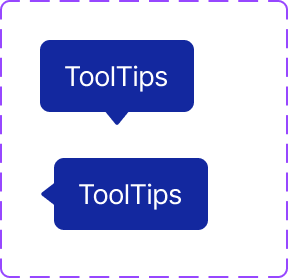

접근성: **`title`만으로 대체하지 말고**, 키보드 포커스 가능한 요소에는 **포커스 시에도** 동일 정보를 노출할 수 있도록 구현을 검토한다.

---

### 8.5 AI·개발 강제 요약

- **금지:** 세로형에 가로형 보더 규칙(보더)을 섞거나, 툴팁 배경을 임의 HEX로만 지정, 페이지 번호를 **10개 초과**로 한 줄에 나열하기.
- **허용:** 세로형 = **8px 라운드·패널 보더·미세 그림자·얼룩말·2줄+말줄임+툴팁**; **하단 바(§8.3)** = 좌 **행 수+범위 문구**, 우 **`<<` `<` 번호×(≤10) `>` `>>`**·액티브 **Primary+흰글자+5px 라운드**; 가로형 = **무라운드·보더·그림자 없음·좌 15px 패딩·14/16 타이포**.
- **검증:** 말줄임 셀에 **호버 툴팁**이 빠지지 않았는지, 클릭 텍스트가 **`--color-status-blue`** 로 통일됐는지, **페이지네이션 숫자 최대 10개·액티브 스타일**이 지켜졌는지 확인한다.

---

## 9. Tab & Textarea Rules (탭·텍스트에어리어)

색·테두리는 **`var(--color-…)`** 만 (§1.11). 탭 그룹은 **키보드 포커스·`aria-selected`** 로 상태를 맞춘다.

### 9.1 기본 탭 (활성 / 비활성)

탭 목록은 **가로 나열**; 각 탭은 **텍스트 라벨**만 두고, **활성**과 **비활성** 두 가지 시각으로 구분한다.

| 상태 | 표시 | 타이포 | 레이아웃 (참고) |
|------|------|--------|-----------------|
| **활성 (ON)** | 하단 **`border-bottom: 3px solid var(--color-primary)`** | **16px Bold**, **`var(--color-text-primary)`** | 높이 **42px**, 좌우 **`padding: 24px`**, 상하 **`padding: 11.5px`** 수준으로 세로 중앙 정렬 |
| **비활성 (OFF)** | **하단 강조선 없음** (배경·밑줄 없는 텍스트 탭) | **16px Regular**, `line-height: 24px`, **`var(--color-text-primary)`** | 활성과 **동일 높이·좌우 패딩**으로 베이스라인 정렬 |

- 인접 탭 사이 구분이 필요하면 **공통 하단 베이스라인**(`1px solid var(--color-border-light)` 등)을 탭 **전체 너비**에 두고, 활성 탭만 **Primary 3px** 로 덮어쓰는 패턴을 쓴다.
- **호버:** 비활성 탭은 `cursor: pointer`, 호버 시 **`--color-primary-10`** 배경 등 **은은한 피드백**을 줄 수 있다(프로젝트 통일).

**시각 참고:** 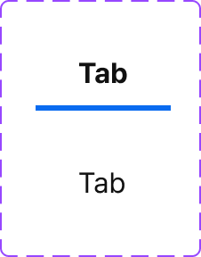

---

### 9.2 텍스트에어리어 (`<textarea>`)

| 속성 | 규칙 |
|------|------|
| **배경** | **`var(--color-white-100)`** |
| **테두리** | **`1px solid var(--color-black-40)`** |
| **모서리** | **`border-radius: 4px`** |
| **최소 높이** | 디자인 기준 **100px** 전후 — 내용·폼에 맞게 늘릴 수 있으나 **동일 화면 내 통일**. |
| **내부 패딩** | 본문 영역 **`10px`** (테두리 안쪽 텍스트 시작점). 바깥 래퍼에 **`2px`** 여유가 있으면 **합산 패딩**이 어긋나지 않게 한 방식만 쓴다. |
| **본문·플레이스홀더** | **14px Regular**, `line-height: 24px`, 플레이스홀더 **`var(--color-black-40)`**, 입력 텍스트 **`var(--color-text-primary)`**. |
| **리사이즈** | 우하단 **드래그 핸들** 허용(브라우저 기본 또는 커스텀 아이콘). `resize: vertical` 권장(가로 무한 확장 방지). |

포커스·에러·비활성 상태는 **§5 일반 인풋**과 같은 토큰 규칙을 적용한다 — **Focused** 테두리 **`var(--color-primary)`**, **Error** **`var(--color-status-red)`**, **Disabled** 면·글자 **`--color-black-10` / `--color-black-20`** 계열.

**시각 참고:** 

---

### 9.3 AI·개발 강제 요약

- **금지:** 탭 활성 구분을 임의 HEX 밑줄로만 지정, 텍스트에어리어 테두리를 인풋 기본과 다른 임의 회색으로 분산.
- **허용:** 탭 = **ON(Primary 3px 하단선·Bold)** / **OFF(선 없음·Regular)**; 텍스트에어리어 = **흰 배경·black40 테두리·4px 라운드·16px/24px**. 포커스·에러는 **§5** 와 동일.
- **검증:** 탭 전환 시 **레이아웃 점프**가 없는지, `textarea`가 **§5** 포커스 링·에러와 충돌하지 않는지 확인한다.

---

## 10. Filter Bar, Filter Panel, Date Picker & Search Dropdown (필터·데이트피커)

테이블 **위**에는 **필터 트리거 + 적용 조건 칩** 한 줄이 있고, 클릭 시 **필터 패널(팝업)** 이 열린다. 패널 안에는 **날짜(Flatpickr)**·**검색형 드롭다운** 등이 올 수 있다. 색은 **`var(--color-…)`** (§1.11). 글씨 크기는 기본 14px.

### 10.1 필터 선택·확인 바 (테이블 상단)

**시각 참고:** 

**위치:** 세로형 테이블 **바로 위**, 한 줄. **두 구역으로 나뉘되 `gap: 0`** 으로 맞닿게 한다.

| 구역 | 역할 | 배경 | 테두리(공통) |
|------|------|------|----------------|
| **앞** | 필터 패널을 여는 **버튼** — 필터 아이콘 + **「필터」** 라벨 + (선택) **적용된 조건 개수** 배지 | **`--color-white-100`** | **`1px solid var(--color-primary-40)`** |
| **뒤** | 적용된 조건 **칩**이 가로로 나열, 각 칩에 **라벨·값·개별 닫기**; 맨 끝에 **전체 초기화** | **`var(--color-primary-5)`** | **동일** **`1px solid var(--color-primary-40)`** |

- 두 구역 **모두** 위 테두리 규칙을 **통일**한다(바깥만 둘레가 이어지도록 `border-collapse`·인접 보더 중복 제거 등으로 구현).
- **칩:** 한 조건씩 노출, **닫기**로 해당 조건만 제거.
- **전체 초기화:** 맨 뒤 **`a` 링크** — **`--color-primary`** 텍스트(및 밑줄 유무는 프로젝트 통일). Figma 예시의 **「필터 초기화」** 버튼과 **동일 역할**이면 스타일만 §3 버튼 Small과 맞출 수 있으나, 문서 기준 **전체 리셋은 `<a>`** 로 둔다.

**레이아웃 (참고):** 전체 높이 **50px** 전후, 앞 구역은 아이콘·텍스트·숫자 배지를 `inline-flex` 로 중앙 정렬.

---

### 10.2 필터 패널 (드롭다운·모달)

**시각 참고:**

- **1열(한 단 그리드) 예시:** 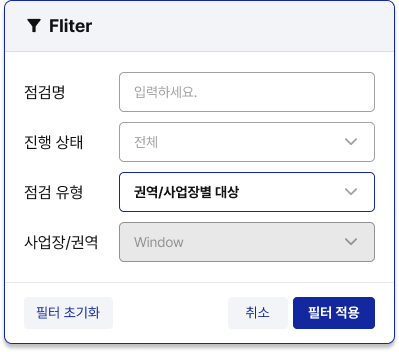
- **3열(다단 그리드) 예시:** 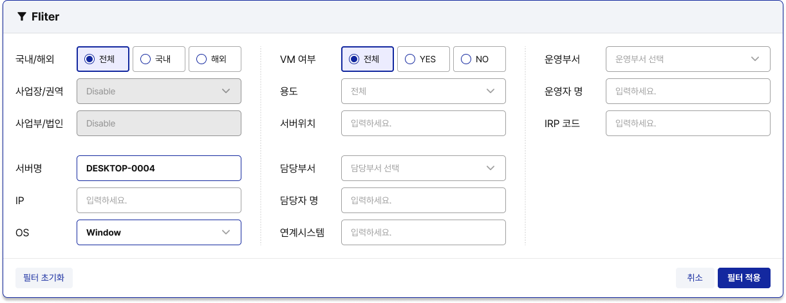

**구조 (세 블록):**

1. **상단 타이틀 바** — 필터 아이콘 + **「필터」** 제목, 하단 **`1px`** 구분선(패널 테두리와 동일 계열).
2. **본문** — 스크롤 가능 영역 안에 **필터 행**만 세로로 쌓는다.
3. **하단 버튼 바** — `flex` + `space-between`.
4. **색상 및 그림자:** 배경 **`--color-white-100`**, 외곽 테두리 **`1px solid var(--color-primary)`**. 그림자는 **§15.2 GNB 팝오버·§13 모달**과 동일하게 **`box-shadow: var(--shadow-popover)`** (§1.10) 로 통일한다.

**본문 규칙:**

- **한 줄 = 라벨 + 컨트롤 1세트**, **라벨과 인풋은 가로 정렬**(**§5.0.1 필터 행**).
- **한 열(컬럼)에 필터는 최대 6개**까지 **세로** 나열. 필터 개수가 더 많으면 **2단·3단 그리드**로 컬럼을 나눈다(열 간 **세로 구분선**은 디자인과 동일하게 `0~1px` 중립선).
- 각 그리드 셀 안에서 인풋·드롭다운·라디오 그룹은 **`width: 100%`** 로 **남는 가로를 채운다**(`min-width: 0` 로 flex 수축 허용).

**하단 버튼:**

- **왼쪽:** **필터 초기화**(패널 안 값만 초기화).
- **오른쪽:** **취소** · **필터 적용** (§3 Small/Medium 버튼 타입과 맞춤).

내부 컨트롤은 **§5 필터 인풋**, **§6 라디오**, **§10.3·§10.4** 를 따른다.

---

### 10.3 데이트피커 (Flatpickr 고정)

**구현:** 날짜·기간 선택은 **Flatpickr**만 사용한다(로케일 `ko` 등). `style.css` 의 **`.flatpickr-*` 커스텀**과 **커스텀 푸터(닫기/저장)** 패턴을 유지·확장한다.

**시각 참고:** 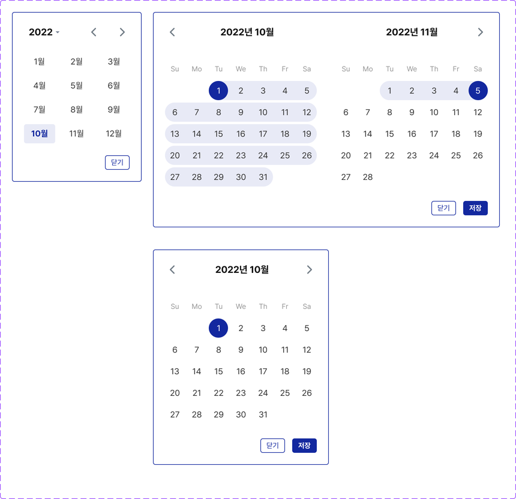 · 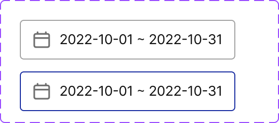

#### 트리거 인풋 (활성 전·후)

| 상태 | 테두리 | 기타 |
|------|--------|------|
| **기본** | **`1px solid var(--color-black-40)`** | 높이 **40px**, **`border-radius: 4px`**, 좌우 **`padding: 12px`**, 상하 **`6px`**. 왼쪽 **캘린더 아이콘 20px**, 텍스트와 **`gap: 8px`**. 표시 값 **14px Regular**, **`--color-text-primary`**. 범위는 **`YYYY-MM-DD ~ YYYY-MM-DD`** 형식 권장. |
| **포커스·열림** | **`1px solid var(--color-primary)`** | 동일 치수. |

#### 캘린더 UI (피그마와 동일하게 맞출 것)

- **컨테이너:** 흰 배경, **`1px solid var(--color-primary)`**, **`border-radius: 4px`**, 안쪽 **`padding: 20px`**.
- **범위 선택:** **시작일·종료일**은 **원형**, 배경 **`--color-primary`**, 글자 **`--color-white-100`**. **그 사이 구간**은 행 단위 **`--color-primary-10`** 면으로 이어지는 **캡슐형 하이라이트**(Flatpickr `inRange` 스타일).
- **요일 헤더:** **12px**, 색 **`var(--color-text-muted)`** (보조 라벨 톤, §1.6).
- **일자 숫자:** **14px**, 색 **`var(--color-text-primary)`**.
- **월 제목:** **16px Bold**, **`--color-text-primary`**; 좌우 **이전/다음** **24px** 아이콘 영역.
- **이중 월:** 나란히 두 달(범위 선택), 월 헤더 간격·그리드 열 정렬은 피그마 레이아웃을 따른다.
- **하단:** **닫기** — 흰 배경 + **`1px solid var(--color-primary)`** + Primary 글자; **저장** — 배경 **`--color-primary`** + 흰 글자. 높이 **24px** 전후, **`border-radius: 4px`**, **`padding: 0 10px`**.

Flatpickr 테마는 **선택·범위·오늘** 등 모든 강조색을 **`--color-primary`** 계열로만 맞춘다.

---

### 10.4 드롭다운 + 패널 내 검색

**용도:** 옵션이 많을 때 **트리거 → 패널**에서 **검색으로 걸러 선택**한다.

**시각 참고:** 

**트리거 (필터용 셀렉트):**

- 높이 **40px**, 열릴 때(포커스·펼침) **`border: 2px solid var(--color-primary)`**, **`border-radius: 5px`**, 좌우 **15px**, **14px Regular**, 쉐브론 트레일링 — **§5.2 Completed** 계열과 동일한 “강조 테두리” 톤.

**패널:**

- 배경 **`--color-white-100`**, **`1px solid var(--color-black-20)`**, **`border-radius: 5px`**, 안쪽 **`padding: 10px`**.
- **상단:** **§5.4** 의 **드롭다운 안 검색 행**과 동일 — 배경 **`--color-bg-base`**, **테두리 없음**, **32px** 높이, **14px**, 검색 아이콘 + placeholder **`--color-black-40`**.
- **목록:** 스크롤 영역, 항목 **14px**, **`border-radius: 5px`**, 행 패딩 **`7px 10px`**. **「선택안함」** 행은 배경 **`--color-black-10`**. **코드+이름 2열**일 때 코드 **`--color-primary-60`**(또는 동일 투명도), 이름 **`--color-text-primary`**, 열 간 **`gap: 2px`**.
- **스크롤바:** 트랙 **`--color-black-20`** 계열 **얇은 바**로 피그마와 유사하게.

**그리드:** 옵션 내용에 따라 목록을 **1열** 또는 **2열 그리드**로 나눈다(짧은 라벨은 2열, 긴 설명은 1열 등 **화면별 일관**).

---

### 10.5 AI·개발 강제 요약

- **금지:** 필터 날짜에 네이티브만 쓰고 디자인을 맞추려 함, Flatpickr 없이 이중 월·범위 UI를 새로 구현.
- **허용:** §10.1 바, §10.2 패널, **Flatpickr + §10.3 색·레이아웃**, §10.4 검색 드롭다운.
- **검증:** 필터 바 **양 구역 보더 통일·gap 0**, 패널 **6행 초과 시 다단**, 인풋 **`width: 100%`**, 데이트 **Primary 계열만** 사용했는지 확인한다.

---

## 11. Slide Panel (슬라이드 팝업)

**시각 참고:** 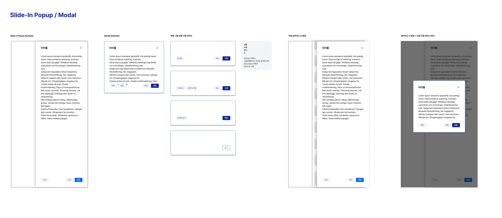

화면 **우측**에서 들어오는 **패널형 UI**다. **내부 컨텐츠**는 화면마다 달라지므로 본 절에서는 **껍질·동작·치수·시각 규칙**만 정한다. 시각은 고객사 디자인 시안의 슬라이드 패널 프레임과 맞추되, **수치·동작은 본 절이 우선**이다. 레이아웃·스크롤/하단 분리 패턴은 **자산 소유 현황** 화면의 슬라이드 팝업을 참고할 수 있으나, **구현 수치는 본 절과 다르면 본 절에 맞출 것**.

### 11.1 모달과 구분

- **차단형 모달** 규칙은 **§13** 을 따른다. 본 절은 **비차단 슬라이드**만 다룬다.
- **딤(반투명 전체 오버레이) 없음.** 뒤 페이지·그리드·버튼은 **그대로 클릭 가능**하다.
- **비차단(non-blocking)** 패널로 취급한다. `role="dialog"`, 제목 연결(`aria-labelledby`), 닫기 버튼 **`aria-label="닫기"`** 등은 갖춘다.

### 11.2 단수·너비

| 구성 | 1단 패널 너비 | 2단 패널 너비 |
|------|---------------|---------------|
| **2중이 필요 없는 화면** | **1000px** | — |
| **2중 구조**(1단 안에서 2단 오픈) | **1000px** | **900px** |

- **고정 규칙:** **1단 패널 = `1000px`**, **2단(2중) 패널 = `900px`** 로 **고정**한다. 화면마다 임의로 너비를 바꾸지 않는다.
- 공통 **`max-width: 100vw`**, 좁은 뷰포트에서는 가로 스크롤 없이 패널이 **뷰포트 안에 맞게** 줄어든다(고정 의도는 유지, 실측은 `min(고정px, 100vw - 여백)` 등으로 구현).
- 2단은 1단 **위에 겹쳐** 오른쪽에서 한 겹 더 들어오는 형태로, **z-index**로 2단이 위다.

### 11.3 포인터·다른 항목으로 교체

- **전체 화면 고정 래퍼**는 **`pointer-events: none`**, **패널 박스만 `pointer-events: auto`** 로 두어 뒤 컨텐츠가 클릭되게 한다.
- **슬라이드가 열린 상태**에서 **다른 트리거**(다른 행·버튼 등)로 또 열면: **기존 패널은 닫힐 때 슬라이드 트랜지션 없이** 즉시 사라지고 **새 패널**이 나타난다(또는 동일 패널에 내용만 갱신).

### 11.4 닫기

- **우측 상단** 닫기 아이콘 버튼(Material Symbols `close` 등).
- **슬라이드 패널 영역 밖**(뷰포트에서 패널 직사각형 **밖**)을 클릭해도 닫힌다. 딤이 없으므로 “밖”은 주로 **패널 왼쪽 본문**이다.
- **2단이 함께 열린 상태**에서 바깥 클릭 시 **2단만 먼저 닫기** vs **한 번에 전부 닫기** 중 **제품 안에서 하나로 통일**한다.

### 11.5 영역 구조·패딩·스크롤·하단 버튼

**일반적인 골격:**

1. **타이틀(헤더)** — 상단, **패딩 20px**. 제목·아이콘·우측 닫기.
2. **컨텐츠** — 그 아래, **패딩 30px**. (그 사이·아래에 정보 바·탭 등이 들어갈 수 있으며, **복잡한 화면**은 패딩·구역을 설계에 맞게 조정 가능.)

**하단 버튼:**

- **있을 수도 없을 수도 있음.**
- 있을 때: 패널을 **`flex` 세로 컬럼 + `overflow: hidden`**, 컨텐츠는 **`flex: 1` · `min-height: 0` · `overflow-y: auto`**, 버튼 행은 **`flex-shrink: 0`** 으로 **하단 고정**. 스크롤은 **본문만**, 버튼 줄은 **스크롤에 묻히지 않음**.

### 11.6 배경·테두리·그림자

| 항목 | 규칙 |
|------|------|
| **배경** | **`--color-white-100`** |
| **패널 외곽 테두리** | **없음** |
| **그림자** | **X −4px**, **Y 0**, **blur 20px**, 색 **Black 20%** → **`var(--color-black-20)`** |

```css
.slide-panel {
  background: var(--color-white-100);
  border: none;
  box-shadow: -4px 0 20px var(--color-black-20);
}
```

내부 구분선(헤더 하단 등)은 **§1 토큰** 보더·텍스트로 처리하고, **패널 바깥 한 줄 border**는 두지 않는다.

### 11.7 애니메이션·포커스

- **열기:** 우측 슬라이드 인 트랜지션 가능(시간·이징은 프로젝트 통일).
- **§11.3 교체** 시 **사라지는 패널**은 **트랜지션 없이** 제거.
- **§3.7** 패널 래퍼 `outline` 제거와 실제 컨트롤 `:focus-visible` 규칙을 함께 적용한다.

### 11.8 AI·개발 강제 요약

- **금지:** 전체 딤으로 뒤 클릭 차단, 2중 너비 임의 변경, 패널 외곽 보더를 필터 패널(§10.2)과 혼동해 동일 규칙 적용.
- **허용:** §11.2 너비, §11.6 그림자, §11.5 스크롤/하단 분리, §11.3·§11.4 동작.
- **검증:** 뒤 클릭 가능, 바깥 클릭 닫기, 너비는 **1단 `1000px` · 2단 `900px`** 고정(§11.2), **`box-shadow: -4px 0 20px var(--color-black-20)`**.

---

## 12. Summary Portlet Pattern (요약 포틀릿 — 느슨한 표준)

메인 화면마다 데이터 모델이 달라도, 요약 포틀릿은 **완전 자유형**이 아니라 **공통 뼈대 + 화면별 변형**으로 관리한다. 본 절은 픽셀 고정 스펙이 아니라 **느슨한 표준**이다.

### 12.1 적용 원칙

- 목적은 “핵심 지표를 빠르게 스캔”하는 것이며, 상세 분석은 하단 테이블/차트로 넘긴다.
- 화면별로 카드 수·지표 항목·보조 표현(도트/바/텍스트)은 달라질 수 있다.
- 다만 **타이포·간격 스케일·토큰 색 체계**는 동일하게 유지한다(§1~§4).

### 12.2 공통 구조(필수)

요약 포틀릿은 아래 3블록을 기본으로 가진다.

1. **헤더 영역**: 제목, 기준 시점(예: 오늘/최근 7일), 보조 액션(새로고침/펼침·접기 등)
2. **핵심 KPI 영역**: 큰 숫자(값) + 단위(건, 대, %) + 증감 정보(선택)
3. **보조 정보 영역**: 세부 분해(예: Pass/Fail, 사업장별, 상태별) 또는 보조 안내

### 12.3 Required / Recommended / Optional

| 등급 | 항목 | 규칙 |
|------|------|------|
| **Required** | 정보 계층 | 제목 → 핵심 값 → 보조 정보 순서를 유지한다. |
| **Required** | 색상 | 임의 HEX 대신 **`var(--color-...)`** 토큰만 사용한다. |
| **Required** | 숫자 표기 | 천단위 구분, 단위 표기(건/대/%), 소수점 자리수 규칙을 화면 내에서 통일한다. |
| **Required** | 상태 표현 | 증감/상태 색은 §4 상태 패밀리 규칙과 일관되게 매핑한다. |
| **Recommended** | 레이아웃 안정성 | 데이터 길이가 달라도 카드 높이·정렬이 크게 흔들리지 않게 한다. |
| **Recommended** | 빈 상태 | 데이터 없음 시 메시지/아이콘/대체값(`-`) 패턴을 제공한다. |
| **Optional** | 보조 시각화 | 미니 바, 도트, 아이콘, 배지 등은 화면 성격에 맞게 선택한다. |
| **Optional** | 상호작용 | 펼침/접기, 드릴다운 링크, 툴팁은 필요한 화면에서만 사용한다. |

### 12.4 화면별 변형 가이드

- **허용되는 변형:** 카드 개수, 보조 지표 형태, 컬럼 수, 접힘/펼침, 강조 지표 우선순위
- **지양할 변형:** 같은 제품 안에서 화면마다 숫자 포맷·상태 색 의미·아이콘 스타일이 바뀌는 것
- **체크 포인트:** “한 화면에서 처음 보는 사용자도 3초 내 핵심 수치 1~2개를 읽을 수 있는가”

### 12.5 금지 사항

- 요약 포틀릿마다 완전히 다른 컴포넌트 철학(타이포/간격/색 시스템)을 도입하는 것
- 동일 의미의 상태를 화면마다 다른 색으로 표현하는 것
- 데이터가 길어졌다는 이유로 포틀릿 자체를 임의 테이블처럼 변형해 가독성을 깨는 것

### 12.6 Dashboard Widget (대시보드 포틀릿) — UX 표준 및 렌더링 제약

대시보드 본문에 배치되는 **카드형 위젯**은 고객사·메뉴마다 **지표·데이터 구조**는 달라질 수 있으나, **껍데기(Wrapper)·헤더·색 의미·6가지 Body 타입**은 본 절을 **절대 기준**으로 한다. 마크업·클래스명은 프로젝트·AI가 자율적으로 잡되, 아래 **시각·동작 제약**을 어기지 않는다.

**디자인 참조(고객사 대시보드 프레임):** [Samsung — Dashboard (Figma)](https://www.figma.com/design/rf40459KZuFvCLiBIvtKfu/Samsung?node-id=466-3153&m=dev)

#### 12.6.1 위젯 컨테이너(Card Wrapper) — 시각 강제

| 항목 | 규칙 |
|------|------|
| **배경** | **`var(--color-white-100)`** — 페이지 베이스(`--color-bg-base` 등)와 대비되게 **솔리드 화이트** 카드로 분리한다. |
| **모서리** | **`border-radius: var(--radius-card)`** (§1.10, 기본 **8px**). 한 대시보드 안에서는 **8~12px 범위**를 쓸 수 있으나 **위젯 간 동일 값**으로 통일한다. |
| **그림자** | **`box-shadow: var(--shadow-card)`** — Bootstrap `shadow-sm`에 해당하는 **매우 옅은 단일 레벨** 그림자. 임의 `rgba(...)`만으로 새 그림자를 정의하지 않는다. |
| **(선택) 테두리** | 배경 대비가 약할 때만 **`1px solid var(--color-black-4)`** 또는 **`var(--color-black-10)`** 계열 **한 줄**로 보조 구분(프로젝트 통일). |

#### 12.6.2 위젯 헤더(Header) 구조

- **레이아웃:** `display: flex`, **`justify-content: space-between`**, **`align-items: center`**, 헤더와 본문(Body) 사이 구분은 **`1px`** 보더 또는 **패딩만**으로 처리 — 프로젝트에서 하나로 고정.
- **좌측:** **Material Symbols Outlined** 섹션 아이콘 + **위젯 타이틀**. 타이틀은 **`var(--color-text-primary)`** 또는 **`--color-black-80`** 계열, **`font-weight: 700`**, 본문 대비 **한 단계 작은 제목 크기**(예: **16px~18px**)로 통일.
- **우측:** (1) 상세 화면 이동 — **`chevron_right`** 등 **한 단계 진입**을 뜻하는 아이콘만 두거나, (2) **위젯 전용 조작** — 기간 콤보, 국내/해외 토글 등. **둘 다 필요하면** 아이콘 + 컨트롤 순서를 **모든 위젯에서 동일 패턴**으로 맞춘다.
- **접근성:** 상세 이동 아이콘은 **`button`** 또는 **`a`** + **`aria-label`**(예: `"OOO 상세 보기"`).

#### 12.6.3 Primary 포인트(시선 유도)

다음 요소는 **반드시 `var(--color-primary)`**(링크·숫자·탭 활성 면/글자 등 맥락에 맞게 **본색 또는 Primary 계열 토큰**)로 통일한다.

- **핵심 KPI 숫자** 중 “이 위젯의 주인 숫자”(예: 전체 건수, 총합)
- **탭·세그먼트**의 **활성(Selected)** 상태
- **테이블 첫 번째 주요 컬럼** 등 **클릭 가능한 앵커 텍스트** 링크

#### 12.6.4 데이터 인디케이터(범례·뱃지·도트) — 의미 색 매핑

차트 범례, 상태 뱃지, **도트 인디케이터**는 아래 **의미 → 팔레트**로 고정하고, 실제 색은 **§4.0 Status 3단**(White / Light / 본색) 또는 **§4.0.1 중립**으로 구현한다. **임의 HEX 금지**(§1.11).

| 의미 묶음 | 팔레트(개념) | 토큰 방향(예) |
|-----------|--------------|----------------|
| 정상·완료·양호 | Success / Green | `--color-status-green` 계열 |
| 오류·반려·취약 | Danger / Red | `--color-status-red` 계열 |
| 진행중·비중 강조·“전체” 축의 브랜드 강조 | Primary / Blue | **`var(--color-primary)`** 및 **`--color-status-blue`** 계열(§4와 충돌 없게 택일) |
| 대기·인터뷰·주의 스캔 | Warning / Orange·Yellow | `--color-status-orange` · `--color-status-yellow` 계열 |

> **주:** 운영 뱃지 라벨과의 1:1 매핑은 **§4.7** 표를 우선한다. 위젯 범례는 **시각적 의미**가 같으면 **동일 색 패밀리**를 쓴다.

#### 12.6.5 표준 위젯 UX 타입 (6 Types) — Body 레이아웃

주입 데이터 구조를 보고 **아래 6가지 중 하나**만 선택해 Body를 렌더링한다. **한 위젯 안에서 타입을 섞지 않는다.** 복합이 필요하면 **Type 6**을 쓴다.

| 타입 | 적용 데이터 | 렌더링 지침 |
|------|-------------|-------------|
| **Type 1 — Summary (요약형)** | 최상단 강조 지표(전체 현황, 오류 건수 등) | **우측 상단**에 연한 배경(예: **`--color-primary-10`** 또는 **`--color-black-10`**)의 **아이콘 박스**. **중앙**에 **큰 숫자** — 긍정/중립은 **`var(--color-primary)`**, 경고·오류 강조는 **`--color-status-red`** 등 §12.6.4에 맞춤. **하단**에 **도트 + 라벨 + 서브 숫자**를 **가로 한 줄(또는 줄바꿈 가능한 flex-wrap)** 로 배치. |
| **Type 2 — Table (테이블형)** | 다중 컬럼 리스트(최근 점검 계획 등) | **`thead` / `tbody`** 구분, 행 **`border-bottom`** 으로 구분. **첫 주요 컬럼**은 링크 스타일 + **`var(--color-primary)`**. 상태는 **§4** 뱃지(솔리드/아웃라인) 규칙 준수. |
| **Type 3 — Tab List (탭 목록형)** | 상태별 필터가 필요한 목록(신청 현황 등) | 상단 **요약 탭**(전체/진행/완료 등) — **활성 탭**은 배경·글자에 **Primary** 적용. 리스트 행은 **2줄 구조**: 좌 **메인 타이틀**, 우상 **상태 뱃지**, 우하 **날짜**(또는 보조 메타). |
| **Type 4 — Chart (차트형)** | 비율·분포(OS별 등) | **차트 엔진은 `Chart.js`만**(문서 상단 「차트 라이브러리 표준」). **도넛(Doughnut)** 등으로 **중앙에 총합 텍스트**(플러그인 또는 오버레이) 배치. **커스텀 범례:** **우측 세로** — **컬러 바(\|)** + 라벨 + 숫자 + 단위(대/건) **우측 정렬** 리스트. **ECharts / ApexCharts / Highcharts 금지.** |
| **Type 5 — Progress (진행상황형)** | 점검 진척도·소진율 등 | 가로 **Progress bar**. 다중 구간은 **Stacked** 바; 구간 색은 **§12.6.4** 매핑. |
| **Type 6 — Complex (복합형)** | 지표 2개 이상 결합 | **CSS Grid 또는 Flex**로 **2단**(예: 좌 차트·우 테이블). **좁은 뷰포트**에서는 **세로 스택**으로 전환(`min-width` 미디어쿼리 또는 `flex-direction`/`grid-template-columns: 1fr`). |

#### 12.6.6 렌더링 방어 로직

- **Empty:** 데이터 배열이 비었거나 API가 빈 응답일 때 **헤더는 유지**, Body **정중앙**에 아이콘(선택) + **「데이터가 없습니다」** 등 짧은 문구(§18 톤과 맞출 것). 카드 **외곽 높이**가 무너지지 않게 **`min-height`** 를 Body에 둘 수 있다(대시보드 그리드 내 통일).
- **오버플로우:** **Type 2·3**에서 행이 많으면 Body에 **`overflow-y: auto`** 와 **`max-height`**(또는 그리드 셀 높이 제한)를 주거나, 셀 텍스트에 **`text-overflow: ellipsis` / `white-space: nowrap`** 를 적용 — **위젯 카드 전체가 뷰포트를 밀어내지 않게** 한다.

#### 12.6.7 AI·개발 강제 요약 (위젯 전용)

- **금지:** 카드마다 다른 그림자·라운드, 위젯 내 **Chart.js 외** 차트 라이브러리, 범례·도트에 임의 HEX, Type 4에서 ECharts 등 타 라이브러리 문구·구현.
- **허용:** §12.6.1~12.6.6 범위 내 마크업 자율, 고객사별 **지표 개수·라벨 문구** 변경.
- **검증:** Wrapper = **화이트 + `var(--radius-card)` + `var(--shadow-card)`**, 헤더 좌 아이콘+볼드 타이틀·우측 액션, Primary 포인트 일관, 6 Types 중 **하나**로만 Body 구성, Empty·스크롤/말줄임 동작 확인.

### 12.7 AI·개발 강제 요약 (요약 포틀릿·대시보드 공통)

- **금지:** 포틀릿·대시보드 위젯을 화면마다 별개 디자인 시스템으로 구현, 상태색/숫자 포맷 임의 변경, **§12.6** 위젯에서 차트 라이브러리 혼용.
- **허용:** §12.2 공통 뼈대 유지 + 화면별 데이터 특성에 맞는 변형(카드 수/보조 지표/접힘 여부), **§12.6** 6 Types 선택 및 고객사 지표 구성.
- **검증:** 정보 계층(제목→값→보조) 유지, 토큰 사용, 숫자·상태 규칙의 화면 간 일관성, 대시보드 카드는 **§12.6.1 Wrapper** 일치 여부.

---

## 13. Modal Dialog (모달 팝업)

화면 중앙에 뜨는 **차단형(blocking) 대화상자**다. **§11 슬라이드 팝업**과 달리 **딤으로 뒤 컨텐츠를 가리고 클릭을 막는다.** 내부 폼·문구는 화면마다 다르므로 본 절은 **껍질·딤·타이포 기본값·버튼 배치**만 정한다. 시각은 고객사 디자인 시안과 맞추되 **수치·토큰은 본 절이 우선**이다.

**시각 참고 (차단형 모달, §13.6 버튼 개수별):**


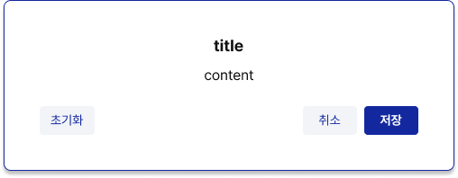

### 13.1 슬라이드 팝업과 구분

| 항목 | 모달 (본 절) | 슬라이드 (§11) |
|------|----------------|----------------|
| 딤 | **있음** — 전역 **`Black 60%`** | 없음 |
| 뒤 클릭 | 차단(딤·포인터 처리) | 가능 |
| 용도 | 확인·경고·짧은 입력 등 **포커스를 한곳에 모을 때** | 넓은 상세·목록 등 **본문과 병행** |

### 13.2 딤(오버레이)

- **전체 뷰포트**를 덮는 반투명 레이어.
- 색: **Black 60%** → **`var(--color-black-60)`** (`rgba(17, 17, 17, 0.6)`, §1.13과 동일).
- 딤 클릭 시 닫기 여부는 **화면별로 통일**한다(단순 확인은 허용, 삭제·결재 등 위험 액션은 **딤 클릭으로 닫지 않음** 권장).

### 13.3 패널 치수

- **최소 너비 `400px`**. 내용에 따라 **가로,세로가 늘어날 수 있음**.
- **`max-width`**: 뷰포트에서 잘리지 않게 **`calc(100vw - 2 × 여백)`** 등으로 제한(여백은 프로젝트 통일, 예: 32px~48px).
- **높이**: 내용에 따름. 긴 본문은 **모달 본문만 스크롤**하고, **버튼 줄은 하단에 고정**하는 패턴을 권장(§11.5와 동일 원칙).
- **패딩:** 패딩 수치는 **40px**로 적용한다. 내용이 많을 경우 줄일 수 있으나, **최소 패딩은 20px**으로 고정한다.

### 13.4 패널 시각(배경·테두리·그림자)

| 항목 | 규칙 |
|------|------|
| **배경** | **`--color-white-100`** |
| **외곽 테두리** | **`1px solid var(--color-primary)`** (Primary 100%) |
| **그림자** | **X 0**, **Y 4px**, **blur 4px**, 색 **Black 20%** → **`var(--color-black-20)`** |

```css
.modal-dim {
  background: var(--color-black-60);
}
.modal-panel {
  background: var(--color-white-100);
  border: 1px solid var(--color-primary);
  box-shadow: 0 4px 4px var(--color-black-20);
}
```

### 13.5 타이포(기본)

| 구분 | 기본 | 비고 |
|------|------|------|
| **타이틀** | **18px Bold**, **`--color-text-primary`** | `role="dialog"` 제목과 연결(`aria-labelledby`) |
| **본문·설명** | **16px Regular**, **`--color-text-primary`** | 폼 라벨·보조문은 §2·§5와 맞출 수 있음 |

- **복잡한 컨텐츠**(표·다단 폼 등)는 타이틀·본문 크기를 **화면 설계에 맞게** 조정할 수 있으나, **같은 유형 모달끼리**는 통일한다.

### 13.6 하단 버튼 정렬·타입

버튼 **스타일(1st / 2nd / 3rd)** 은 **§3** (예: `.btn-ds-1st` · `.btn-ds-2nd` · `.btn-ds-3rd`)을 따른다.

- **가장 중요한 액션 하나**에만 **1st(Primary)** 를 쓴다. 나머지는 중요도 순으로 **2nd → 3rd** (또는 취소만 2nd 등).
- **버튼 개수 1~2개:** 한 줄에서 **`justify-content: center`**, 버튼 사이 **`gap`** 은 프로젝트 통일(예: 8px~12px).
- **버튼 3개 이상:** **`justify-content: space-between`** 으로 **좌·우 끝**에 붙인다. 보통 **취소·보조**는 왼쪽 그룹, **주요 확정**은 오른쪽에 두되, **1st는 하나만** 유지한다.

### 13.7 접근성·포커스

- `role="dialog"`, **`aria-modal="true"`**, 제목 **`aria-labelledby`** (또는 `aria-label`).
- 닫기 버튼 **`aria-label="닫기"`**. **§3.7** 모달 래퍼 `outline` 제거와 내부 컨트롤 `:focus-visible` 규칙을 함께 적용한다.
- 열릴 때 **포커스를 다이얼로그 안**으로 옮기고, 닫힐 때 **트리거로 복귀**하는 것을 권장한다.

### 13.8 AI·개발 강제 요약

- **금지:** 모달에 슬라이드와 동일하게 딤 없이 쓰기, 1st 버튼을 **두 개 이상** 두기, 테두리·그림자를 임의 HEX로만 지정.
- **허용:** §13.3 최소 너비·최대 너비, §13.4 토큰, §13.6 버튼 정렬 규칙, 위험도에 따른 딤 클릭 닫기 예외.
- **검증:** 딤 **`--color-black-60`**, 패널 **`1px solid var(--color-primary)`**, 그림자 **`0 4px 4px var(--color-black-20)`**, 버튼 **1~2=중앙 / 3+=양끝**, **1st 1개**.

---

## 14. Breadcrumb Navigation (브레드크럼)

**목록·대시보드 등 최상위 페이지**에서는 GNB 좌측에 **아이콘 + 단일 화면 제목**을 쓴다. **상위에서 세부 페이지로 들어온 화면**에서는 그 **제목이 들어가던 자리**에 **브레드크럼**을 둔다. 단계를 몇 겹으로 쌓을지·라벨 문구는 **고객사 정보 구조·라우팅**에 따르되, **시각·마크업 규칙은 본 절**을 따른다(디자인 시안의 생성 규칙과 맞출 것).

### 14.1 배치

- **위치:** GNB **좌측**, 기존 **화면 제목 영역**(아이콘+제목이 쓰이던 슬롯).
- **세부 페이지:** 해당 슬롯을 **브레드크럼 전용**으로 쓴다(단일 큰 제목 문구와 **동시에 두지 않음**). 영역 아이콘은 **브레드크럼 앞(선행)** 에 두거나 생략할 수 있으나, **한 화면군 안에서만** 통일한다.

### 14.2 구성(한 단계 내려온 경우)

왼쪽에서 오른쪽 순서(한 줄, **20px** — §14.3):

1. **뒤로가기:** **`<a href="…">` 링크 한 덩어리**이고, **태그 안쪽에는 텍스트 대신 화살표(뒤로) 아이콘만** 둔다(Material Symbols 예: `arrow_back` / `chevron_left` — 프로젝트 하나로 고정). **이전 화면으로 가는** 실제 네비게이션이다.
2. **(간격만)** 바로 이어서 **이전(상위) 페이지 이름**(텍스트 또는 해당 목록으로 가는 링크 — 위 **뒤로가기 `<a>`** 와 **목적이 겹치지 않게** 정리).
3. **구분자 `>`** + **현재 페이지 이름**. **현재 페이지만 Bold**, **링크 아님**.

**2단계 이상** 깊이: **`… > 상위 > 현재`** 처럼 **`>`** 로만 단계를 잇고, **맨 마지막만 볼드·비링크**; 앞 단계는 필요 시 링크. 맨 앞의 **`<a>`(내부 화살표 아이콘)** 는 동일하게 유지한다.

### 14.3 타이포·색

| 구분 | 규칙 |
|------|------|
| **전체(한 줄)** | **20px**, Pretendard(§2), 줄 높이는 GNB **60px** 안에서 수직 중앙 정렬. |
| **이전 단계·구분자** | **Regular(400)**, 색 **`var(--color-text-primary)`** 또는 링크면 **`var(--color-primary)`** 로 통일(프로젝트에서 한 가지만 택한다). |
| **현재 페이지** | **Bold(700)**, 색 **`var(--color-text-primary)`**. |

- 폼·부가 설명 등 **GNB 아래 본문** 타이포는 본 절과 별개다.

### 14.4 구분자·간격

- 구분 문자 **`>`** 양옆에 **공백**을 두어 가독성을 맞춘다(예: ` > `). 문자 자체 색은 **이전 단계와 동일** 또는 **`var(--color-text-muted)`** 중 하나로 통일.
- **뒤로가기 `<a>`**(내부 아이콘)·첫 라벨·구분자 사이 **`gap`** 은 **8px~12px** 범위에서 프로젝트 고정.

### 14.5 접근성

- 래퍼에 **`<nav aria-label="브레드크럼">`** (또는 locale에 맞는 짧은 레이블).
- **뒤로가기 `<a>`:** 안에 글자가 없고 **아이콘만** 있으면 **`aria-label="이전 화면으로"`** 등 **스크린 리더용 이름** 필수.
- 현재 페이지는 **`aria-current="page"`** 를 붙일 수 있다(마크업 구조에 맞게 마지막 항목에).

### 14.6 AI·개발 강제 요약

- **금지:** 세부 페이지인데 GNB 좌측에 단일 제목만 두고 브레드크럼 생략, 현재 페이지를 링크로 두기, 구간마다 다른 폰트 크기·볼드 규칙.
- **허용:** §14.2 순서·§14.3 **20px + 현재만 볼드**, 깊이 2 이상 확장, 아이콘 선행 여부는 화면군 단위 통일.
- **검증:** GNB 제목 슬롯에 브레드크럼 배치, **`a` 태그 안에 화살표 아이콘만** 있는 뒤로가기, 이어서 이전 페이지·**`>`**·현재(볼드), 토큰 색 사용.

---

## 15. GNB (Global Navigation Bar) 규칙

### 15.1 레이아웃

```
┌─────────────────────────────────────────────────────────────────────────┐
│ 📋 화면 제목               │ 2026.03.20 월요일 │ 매뉴얼 ▼ │ 👤 사용자 ▼  │
└─────────────────────────────────────────────────────────────────────────┘
```

**시각 참고:** 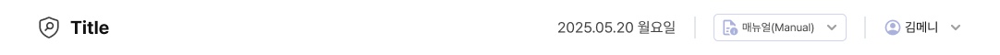

- **위치:** 상단 고정, 전체 너비 `width: 100%`.
- **구성 (좌→우):**
  - **left**
    - **최상위(목록·대시보드 등):** 제목에 맞는 아이콘 + **현재 화면 제목**
    - **세부 페이지:** 동일 슬롯에 **§14 브레드크럼** — **`<a>` 안에 화살표 아이콘만** 있는 뒤로가기 → 이전 페이지 → **`>`** → **현재 페이지(볼드)**
  - **right**
    - 현재 날짜 (YYYY.MM.DD 요일)
    - **매뉴얼** 트리거(클릭 시 매뉴얼 리스트 팝오버)
    - **사용자** 트리거(클릭 시 마이페이지 팝오버)
- **높이:** 60px
- **배경:** 흰색, 하단 **`border-bottom: 1px solid var(--color-border-gnb)`** (§1.9·`UX-STANDARD-root.css`).

### 15.2 매뉴얼 리스트·마이페이지 팝오버 — 공통 시각

두 팝오버 **패널(떠 있는 박스)** 은 동일한 외곽 규칙을 쓴다.

| 항목 | 규칙 |
|------|------|
| **배경** | **`--color-white-100`** |
| **외곽 테두리** | **`1px solid var(--color-primary)`** (Primary 100%) |
| **그림자** | **X 0**, **Y 4px**, **blur 4px**, **Black 20%** → **`var(--color-black-20)`** |

```css
.gnb-popover-panel {
  background: var(--color-white-100);
  border: 1px solid var(--color-primary);
  box-shadow: var(--shadow-popover);
}
```

- **§10.2 필터 패널**·**§13 모달** 패널과 **그림자·Primary 테두리** 톤을 맞춘다. 내부 구분선·타이틀 바는 **§1** 보더·텍스트 토큰으로 처리한다.
- 시안과의 미세한 라운드·패딩은 고객사 디자인과 동기화하되, **위 표는 필수**다.
- **가로 너비**는 팝오버 종류마다 다르다 — **§15.3·§15.4** 참고.

### 15.3 매뉴얼 리스트 팝오버

**시각 참고:** 

```
┌──────────────────────────────────┐
│ Manual List                    × │
├──────────────────────────────────┤
│ 사용자 메뉴얼 (User Manual)        │
│ 한국어 │ English                  │  ← 높이 24px 버튼 행
│──────────────────────────────────│
│ 테니엄 에이전트(Tanium Agent)      │
│ 설치가이드 Install Guide           │ ← 버튼
│ 윈도우 │ 리눅스                    │ ← 버튼
│ 솔라리스 │ AIX                    │ ← 버튼
│──────────────────────────────────│
│ 서버 보안 점검 체크리스트            │
│ (Server Security Checklist)      │
│ 한국어 │ English                  │
│──────────────────────────────────│
│ 보안 담당자 메뉴얼                  │
│ (Manual for Security Manager)    │
│ 한국어 │ English                  │
│──────────────────────────────────│
│ 주요 Q&A (Major Q&A) - Mosaic     │
│ 전사 보안 점검 상세 가이드           │ ← 버튼
│ Security Diagnosis Detailed Guide│
└──────────────────────────────────┘
```

- **패널 외곽:** §15.2.
- **너비:** **`width: 300px`**. 좁은 뷰포트에서는 **`max-width: min(300px, 100vw - 여백)`** 등으로 잘리지 않게 조정할 수 있다.
- **동작:** 항목별 버튼 클릭 시 **파일 다운로드**(또는 정책에 맞는 액션)를 제공한다.
- **버튼 높이:** 리스트 안 액션 버튼은 **고정 높이 24px** 로 통일한다. `inline-flex` + `align-items: center`, 좌우 패딩은 라벨 길이에 맞게되 **한 팝오버 안에서는 동일 규칙**을 유지한다.
- **언어 쌍(한국어 / English):** 버튼 **앞**에는 **아이콘 대신 국기 이미지**를 둔다 — **한국어** 앞 **`img/lang-ko.png`**, **English** 앞 **`img/lang-en.png`** (**참조 범위** 상단 `img/` 자산 규칙과 동일). 이미지 높이는 버튼(24px) 안에서 **수직 중앙**, 대략 **14px~16px** 높이 권장, 텍스트와 **`gap: 6px`~`8px`**.
- **설치 가이드·OS별·전사 보안 점검 상세 가이드 등:** 언어가 아닌 분기는 **Material Symbols 등 아이콘**을 라벨 앞에 둘 수 있다(§2.3). OS·제품은 필요 시 **`img/os-*.png`** 도 사용 가능하다.

### 15.4 마이페이지 팝오버

**시각 참고:** 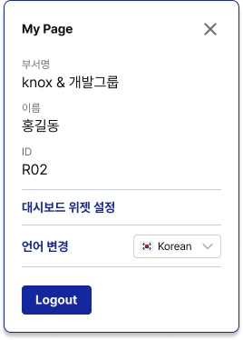

```
┌──────────────────┐
│ My Page        × │
├──────────────────┤
│ 부서명            │
│ knox & 개발그룹    │
│ 이름              │
│ 홍길동             │
│ ID               │
│ R02              │
├──────────────────┤
│ 대시보드 위젯 설정  │
├──────────────────┤
│ 언어 변경 Korean ▼ │
├──────────────────┤
│ [Logout]         │
└──────────────────┘
```

- **패널 외곽:** §15.2.
- **너비:** **`width: 260px`**. 좁은 뷰포트에서는 **`max-width: min(260px, 100vw - 여백)`** 등으로 조정 가능.
- **트리거:** 사용자 이름(또는 프로필) 클릭 시 표시 — Bootstrap `popover` 또는 커스텀 드롭다운 등 구현은 자유이되 **시각은 §15.2** 를 따른다.
- **내용:** 부서명, 이름, ID, 대시보드 위젯 설정 링크, 언어 변경(한국어/English), 로그아웃.
- **로그아웃 등 주요 버튼:** **§3** 버튼 타입·토큰을 따른다(프로젝트에서 Small 등 기존 클래스명을 쓰되, 색·높이는 표준과 충돌하지 않게 맞춘다).

---

## 16. LNB (Left Navigation Bar)

화면 **좌측 고정** 세로 내비게이션이다. **§15 GNB** 아래·옆에서 **본문(`#app`)** 과 나란히 쓰이며, **펼침 / 접힘** 두 상태와 **접힘 시 호버 서브메뉴**가 핵심이다. 레이아웃·동작은 고객사 디자인 시안(펼침·접힘 프레임)과 맞추되, **색·타이포·치수는 본 절·토큰**을 우선한다. 구현체와 수치가 다르면 **본 절에 맞출 것**.

### 16.1 전체 레이아웃 예시

**펼침 (기본 폭)**

```
┌────────────────┐
│    [로고 영역]   │
├────────────────┤
│ 📊 대시보드      │
│ 📄 전자결재    › │
│    · 기안함      │
│ 🛡 점검 관리   › │
│    · 하위 링크   │
│ ⚙ 환경설정       │
├────────────────┤
│            ««  │  ← 접기
└────────────────┘
```

**접힘 (아이콘만)**

```
┌────┐
│ S  │  ← 브랜드 이니셜(§16.3)
├────┤
│ 📊 │
│ 📄 │
│ 🛡 │
│ ⚙ │
├────┤
│ »» │  ← 펼치기
└────┘
```

- **접힘 이니셜:** §16.3 로고 영역과 동일 — **28px** 전후 **Bold**, 색 **`var(--color-primary)`**(또는 `--color-logo`).
- **위치:** `position: fixed`, **왼쪽**, **상단 0**, **높이 100vh** (GNB와 겹치지 않게 **전체 높이**를 쓰는 패턴이면 GNB `z-index`·본문 `padding-top` 과 함께 조정).
- **배경:** **`--color-white-100`**.
- **우측 구분선:** **`1px solid`** — **`var(--color-border)`** 또는 **`#cccccc`** 계열로 통일(구현·시안 동기화).
- **z-index:** 본문·슬라이드·모달과 **겹침 순서**가 깨지지 않게 한 값으로 고정(예: **1050** 전후 — 프로젝트 단일 기준).

**시각 참고 (펼침 메뉴):** 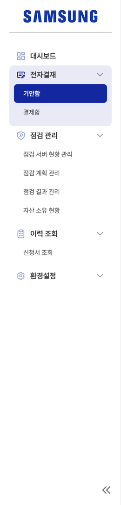

### 16.2 폭·전환

| 상태 | 폭 | 비고 |
|------|-----|------|
| **펼침** | **260px** | 라벨·서브링크 텍스트 표시 |
| **접힘** | **80px** | 그룹·단일 링크는 **아이콘만** |

- **너비 전환:** **`transition: width`** 약 **0.2s** `ease-out` 권장.
- 접힘 시 **본문 영역**은 동일 폭만큼 **`margin-left` / placeholder 폭**을 맞춘다(예: 펼침 260px ↔ 접힘 80px).

### 16.3 로고 영역

- **펼침:** 상단에 **고객사 로고**를 둔다. **이미지 에셋은 빌드·고객마다 교체**(`` 또는 SVG). 높이·여백은 시안과 맞추되, 좌우 **패딩 16px(`1rem`)** 수준을 기본으로 한다.
- **로고 아래:** **`1px`** 가로 구분선(펼침에서만; 접힘에서는 생략 가능).
- **접힘:** 가로 폭이 없어 **풀 로고는 쓰지 않는다.** 대신 **브랜드 이니셜 1글자**를 중앙에 둔다.
  - **규칙:** 고객사 **영문 브랜드명**에서 대표 단어의 **첫 알파벳 1자**(보통 **대문자**). 예: Manyinsoft → **M**, Samsung → **S**.
  - **스타일 참고:** **28px** 전후 **Bold**, 색 **`var(--color-primary)`** (또는 `--color-logo`가 브랜드 정책과 맞으면 동일).
  - 법적·브랜드 가이드가 있으면 **그에 따른 약자**를 쓴다.

### 16.4 펼침 — 메뉴 구조·타이포·패딩

- **스크롤:** 항목 영역만 **`overflow-y: auto`**, 스크롤바는 얇게 숨기거나 디자인에 맞게 처리.
- **그룹·행 패딩:** 그룹 컨테이너 **8px(`p-2`)**; 1차 행(헤더·단일 링크) **`padding: 8px 12px`** (`py-2` `px-3`), 아이콘·라벨 **`gap: 8px`**.
- **아이콘:** Material Symbols **20px**, 메뉴 의미에 맞게 선택(§2.3) — 대시보드 `dashboard`, 문서 `description`, 점검 `shield`, 설정 `settings` 등.
- **1차 라벨:** **Bold(700)**, 색 **`var(--color-text-secondary)`** (`--color-black-80` 계열). 그룹 우측 **`chevron_right`** 는 **`var(--color-text-muted)`**.
- **2차(서브) 링크:** 왼쪽 **들여쓰기**(`ps-4` 등), **14px Regular**, **`var(--color-text-muted)`**, 행 높이·패딩은 **세로 여유 있게** (참고: `py-2`).
- **모서리:** 그룹·행 **`border-radius: 10px`** 로 통일.
- **호버(펼침):** 1차 행·단일 링크 **`--color-primary-10`** 배경.
- **활성 그룹:** 배경 **`--color-primary-10`**; 현재 라우트에 맞게 **`active`** 상태를 시각적으로 구분.

### 16.5 접힘 — 아이콘 슬롯·호버 서브메뉴

**시각 참고:** 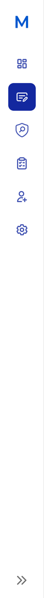 · 

- **그룹 헤더·단일 링크:** **50×50px** 안에 아이콘만 중앙 정렬, **`border-radius: 10px`**, 라벨·쉐브론은 숨김.
- **아이콘 크기:** **24px**.
- **활성 그룹(접힘):** 슬롯 배경 **`var(--color-primary)`**, 아이콘 **`--color-white-100`**.
- **호버 시 서브메뉴:** 접힘 상태에서 **그룹 아이콘에 마우스를 올리면** LNB 오른쪽에 **플로팅 패널**을 띄운다.
  - **위치:** 접힘 폭(**80px**) 바로 옆(예: `left: 80px`), **`position: fixed`**, **`z-index`** 는 LNB보다 한 단계 위(예: **1060**).
  - **크기:** **`min-width: 160px`**, 안쪽 **`padding: 10px`**.
  - **모양:** **`border-radius: 0 10px 10px 10px`** (LNB에 닿는 쪽 직각).
  - **배경:** **`var(--color-primary-10)`** (옅은 Primary 면). 피그마 등에서 다른 톤이 나오면 **`:root`에 토큰을 추가한 뒤 `var(--…)`만** 쓴다(§1.11 — 문서·컴포넌트에 임의 HEX 직접 박지 않음).
  - **테두리:** **`1px solid var(--color-black-4)`** (또는 동일 계열을 `:root`에만 정의).
  - **그림자:** **`var(--shadow-popover)`** (§1.10) 로 통일하거나, 필요 시 **같은 파일 `:root`에 별도 그림자 토큰**을 두고 `var` 로만 참조한다.
  - **항목 링크:** 높이 **36px**, **14px Regular**, 좌 **`padding-left: 20px`**, **`border-radius: 7px`**, 기본 **`var(--color-text-secondary)`**.
  - **항목 호버:** 배경 **`--color-primary-10`**, 글자 **`var(--color-primary)`**.
  - **항목 활성:** 배경 **`var(--color-primary)`**, 글자 **`--color-white-100`**, **Bold**.
- **포커스·키보드:** 가능하면 **Escape** 로 서브메뉴 닫기, **`aria-expanded` / `aria-haspopup`** 등으로 보조한다.

### 16.6 하단 접기/펼치기 컨트롤

- **위치:** LNB **맨 아래** 고정 영역, 펼침 시 **우측 정렬**, 접힘 시 **가운데 정렬**.
- **컨트롤:** **`button`** (링크 아님), **`aria-label`** `"사이드바 접기"` / `"사이드바 펼치기"` 로 상태에 맞게 전환.
- **아이콘:** Material Symbols — 펼침 시 **`keyboard_double_arrow_left`**, 접힘 시 **`keyboard_double_arrow_right`**, **24px**, 색 **`var(--color-text-muted)`**.
- **스타일:** 테두리·밑줄 없는 **`btn-link`** 류; 호버 시에만 은은한 배경 허용.

### 16.7 AI·개발 강제 요약

- **금지:** 접힘에서 풀 로고 이미지를 억지로 넣기, 서브메뉴 없이 그룹만 아이콘으로 두고 이동 수단 없애기, 임의 색으로 활성·호버만 따로 정의.
- **허용:** §16.2 폭 **260 / 80**, §16.3 로고 교체·이니셜, §16.5 플로팅 서브메뉴 토큰화, 하단 **«« / »»** 토글.
- **검증:** 펼침·접힘 전환, 접힘 호버 서브, 활성 상태, 본문 **`lnb-collapsed`** 폭 대응.

---

## 17. Notice Banner (안내 메시지창 — 정보·경고)

콘텐츠 상단 등에서 **정보 전달** 또는 **경고**를 한 줄·여러 줄로 보여 주는 **가로 전체 폭** 배너다. 모달(§13)과 달리 **딤 없이** 흐름을 막지 않으며, **닫기 동작은 타입·맥락에 따라 다르다**. 색은 **§4.0 Status 3단**의 **Green / Red** 패밀리만 쓴다. 시각은 고객사 디자인 시안과 맞추되 **토큰·닫기 규칙은 본 절**이 우선이다.

### 17.1 타입·색 (필수)

| 타입 | 의미 | 배경 | 테두리 (1px solid) | 본문·선행 아이콘 |
|------|------|------|---------------------|------------------|
| **정보** | 안내·성공 맥락 등 | **`--color-status-white-green`** | **`--color-status-light-green`** | **`--color-status-green`** |
| **경고** | 오류·주의·검증 실패 등 | **`--color-status-white-red`** | **`--color-status-light-red`** | **`--color-status-red`** |

- **금지:** 정보에 Red, 경고에 Green을 쓰는 식의 **타입·색 교차**, 임의 HEX 배경만 지정.

### 17.2 폭·구조

- **가로:** 컨테이너 기준 **`width: 100%`** (부모가 콘텐츠 컬럼이면 그 너비에 맞춤).
- **한 줄 레이아웃:** `display: flex`, **`align-items: flex-start`**(또는 `center` — 여러 줄이면 `flex-start`), **`justify-content: space-between`**, **`gap: 12px`**.
  - **왼쪽:** (선택) **선행 아이콘** + **메시지 텍스트** 블록 — `inline-flex` + `gap: 8px`.
  - **오른쪽:** **닫기**가 있을 때만 **`close`** 아이콘 버튼(§17.3).

### 17.3 닫기(X) 동작

| 타입 | 닫기 기본 |
|------|-----------|
| **경고** | **기본적으로 표시** — 사용자가 **X** 로 닫을 수 있다(세션·페이지 정책에 따라 다시 노출 여부는 구현에서 결정). |
| **정보** | **선택** — **필수·항시 노출 안내**(정책 문구, 시스템 고지 등)는 **닫기 없음**. **일시 안내**는 **X** 를 둘 수 있다. |

- **닫기 컨트롤:** **`button type="button"`**, **`aria-label="닫기"`**, 아이콘 Material **`close`**, **24px**, 색은 해당 타입 **본색 토큰**과 동일 계열(호버 시 **`--color-text-primary`** 로 살짝 진하게 해도 됨). 배경 투명, **`border: none`**, **`cursor: pointer`**.

### 17.4 타이포·패딩·모서리

| 항목 | 규칙 |
|------|------|
| **본문** | **14px Regular**, **`var(--color-text-primary)`** — 배너 틴트 위에서도 가독 우선. 강조 한두 단어는 **Bold** 허용. |
| **내부 패딩** | **`12px 16px`** (상하·좌우). 여러 줄이면 **상하만** **14px** 로 조정 가능하나 **한 제품 내 통일**. |
| **모서리** | **`border-radius: 4px`** (`var(--radius-badge)` 와 동일 계열). 콘텐츠 영역 **좌우 끝까지 붙인 풀블리드** 스트립이면 **0** 으로 둘 수 있다 — **화면군별 하나로 통일**. |
| **선행 아이콘** | **20px**(정보: `info` / 경고: `warning` 또는 `error` 등 — 의미만 맞으면 프로젝트 고정). |

### 17.5 배치

- **위치:** 알림 배너·요약 포틀릿과 겹치지 않게 **콘텐츠 최상단** 또는 **화면 제목(GNB) 직하단** 등, **§7·§15** 레이아웃과 맞춘다.
- **여러 개:** 세로 **`gap: 8px`** 로 쌓고, **경고가 정보 위**에 오도록 우선순위를 정한다.

### 17.6 토스트 알림 (Toast)

화면 우상단(또는 제품에서 정한 고정 위치)에 잠깐 나타나는 **비차단형 피드백 메시지**다. **알림 배너(§17.1~§17.5)** 와 달리 페이지 레이아웃을 밀지 않고, 작업 흐름을 끊지 않는다.

| 유형 | 의미 색 | 메시지 예시 | 자동 소멸 |
|------|---------|------------|-----------|
| 성공 | 녹색 | "저장되었습니다." | 3초 |
| 실패 | 빨간색 | "저장에 실패했습니다." | 수동 닫기 |
| 경고 | 주황색 | "3개 세트에 포함되어 삭제할 수 없습니다." | 5초 |
| 정보 | 파란색 | "15건 배정, 3건 중복 제외" | 5초 |

- **색 토큰:** 성공/실패/경고/정보는 §4.0 Status 패밀리(본색·Light·White)에서 매핑하고, 임의 HEX는 금지.
- **닫기 버튼:** 실패 타입은 기본적으로 닫기 버튼(`button`, `aria-label="닫기"`)을 둔다. 다른 타입은 제품 정책에 따라 생략 가능.
- **적층 규칙:** 동시에 여러 개가 뜨면 최신 항목이 위로 오게 세로 스택(`gap: 8px`)으로 쌓는다.
- **역할 분리:** 즉시 피드백은 토스트, 고정 안내·정책 고지는 알림 배너(§17.5)로 구분한다.

### 17.7 AI·개발 강제 요약

- **금지:** 타입별 Green/Red 외 팔레트, 경고에 닫기 없이 사용자가 영구히 못 없애는 UX(정책상 필요한 경우만 예외), 정보 타입에 항상 닫기 강제.
- **허용:** §17.3에 따른 **경고=닫기 기본**, **정보=닫기 선택**, `width: 100%`, §17.4 패딩·14px 본문.
- **검증:** Green/Red **3단 토큰**만 사용, X는 **`button` + `aria-label`**, 정보 배너에 **불필요한 닫기**가 없는지(필수 안내).

---

## 18. Empty & Error State (빈 화면·에러 메시지)

테이블 바디·카드형 위젯·페이지 본문 등 **데이터가 없거나 오류**일 때 보여 주는 **플레이스홀더** 패턴이다. **§17 안내 배너**(스트립)와 달리 **블록 중앙**에 아이콘 + 문구만 올린다. 시각은 고객사 디자인 시안과 맞추되 **치수·토큰은 본 절**을 따른다.

### 18.1 레이아웃

- **컨테이너:** 부모(테이블 영역·위젯·페이지 셀) 안에서 **`display: flex`**, **`flex-direction: column`**, **`align-items: center`**, **`justify-content: center`**, **`text-align: center`**.
- **최소 높이:** 영역이 너무 납작하지 않게 **`min-height`** 를 둔다(예: 테이블 빈 상태 **200px~320px**, 전체 페이지는 **50vh** 전후 — **화면군별 통일**).
- **안쪽 여백:** **`24px`** 이상(상하좌우)으로 터치·가독 여유를 확보한다.

### 18.2 아이콘 영역

- **박스:** **`80px × 80px`** 고정. **`display: flex`**, **`align-items: center`**, **`justify-content: center`**.
- **아이콘 색:** **`var(--color-primary-20)`** (Primary 20% — 배경이 아니라 **아이콘 glyph 색**으로 적용).
- **아이콘 크기:** 박스 안을 채우도록 **56px~64px** 전후(대략 **64px** 권장). **Outlined / Filled** 모두 허용 — 상황·메뉴얼과 맞춰 **프로젝트에서 통일**한다.
- **라이브러리:** Material Symbols(§2.3). **`aria-hidden="true"`** 장식 처리하고, 의미는 **아래 문구**로 전달한다.

### 18.3 안내 문구

- **위치:** 아이콘 박스 **아래**. 아이콘과 **`gap: 12px`~`16px`**.
- **폰트:** **16px ~ 18px**, **`font-weight: 700`**. 한 화면·컴포넌트 타입 안에서는 **한 값으로 고정**(예: 위젯 **16px**, 풀페이지 **18px**).
- **색:** **`var(--color-black-40)`** ~ **`var(--color-black-60)`** 범위 — 보통 **`var(--color-text-muted)`** (`--color-black-60` 계열)에 맞추거나, 더 옅게 **`--color-black-40`**.
- **줄 수:** **1~3줄** 권장. 길면 **`max-width`**(예: **360px~480px**) 안에서 줄바꿈.

### 18.4 상황별 아이콘(권장)

| 상황 | 아이콘 예시(참고) |
|------|-------------------|
| **데이터 없음 / 검색 결과 없음** | `inbox`, `search_off`, `folder_open`, `table_rows_narrow` |
| **오류 / 로드 실패** | `error`, `cloud_off`, `wifi_off`, `broken_image` |
| **권한 없음** | `lock`, `no_accounts` |

- 동일 의미에는 **항목·화면 간 같은 아이콘**을 쓴다.

### 18.4.1 시각 참고 (디자인 시스템 캡처)

아래 캡처는 **형태·밀도**를 맞출 때 참고한다. 아이콘·문구는 §18.2·§18.4 권장과 달라도 되나, **중앙 정렬·여백·타이포 단계**는 본 절과 통일한다.

**데이터 없음**  
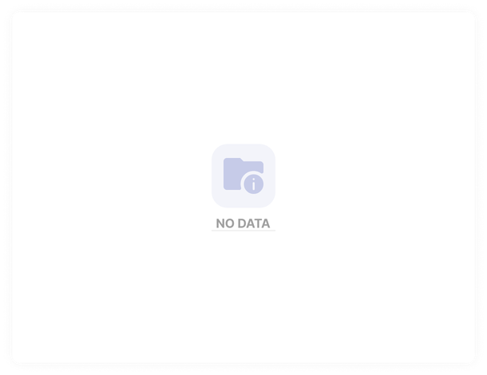

**차트 데이터 없음**  


**연결 끊김**  
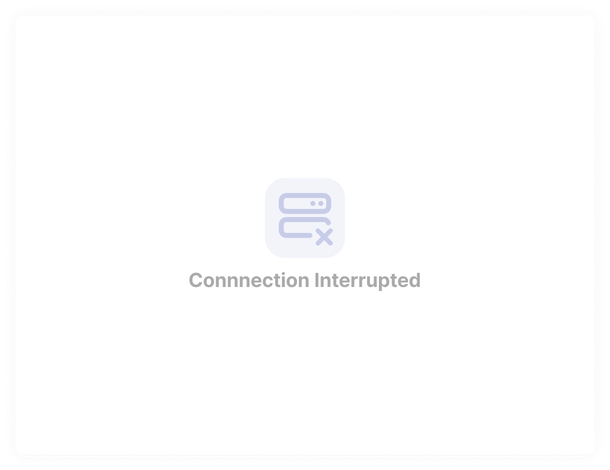

**서버 오류**  
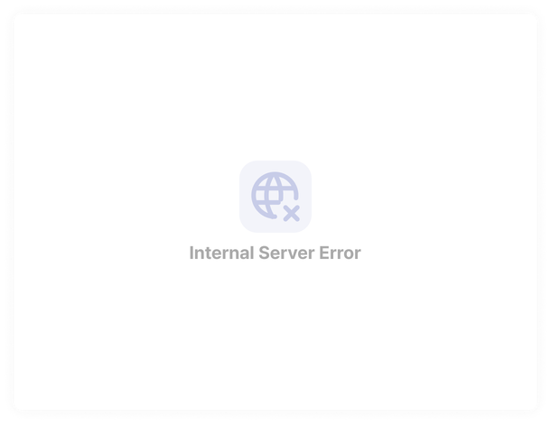

### 18.5 §8 테이블과의 관계

- **세로형 테이블** 빈 행 대신 본 패턴을 쓸 때, **테이블 카드 안 가운데**에 두고 **가로 스크롤**과 겹치지 않게 한다.

### 18.6 AI·개발 강제 요약

- **금지:** 아이콘에 임의 HEX, 80px 박스 없이 작은 아이콘만 두기, 본문을 **100% Black** 로만 두어 대비 과다.
- **허용:** **80×80** 영역, 아이콘색 **`--color-primary-20`**, 문구 **16~18px Bold**, **`--color-black-40`~`60`**, 중앙 정렬.
- **검증:** 빈 상태·에러 상태 **문구 톤** 구분, 스크린 리더용 **숨김 아이콘 + 보이는 텍스트** 조합.

---

## 19. Domain-Specific Operation UX Rules (도메인 운영 UX 규칙)

운영 업무에서 자주 발생하는 **상태 변경·삭제·제출·기한 처리**를 안전하게 수행하기 위한 공통 규칙이다. 본 절은 화면별 개별 판단보다 우선하며, 알림/모달/뱃지/토스트는 **§4, §13, §17** 기준을 함께 따른다.

### 19.1 상태 변경 확인 (필수)

- **적용 대상:** 운영상태, 도출상태, 결재상태, 검토 판정 등 **의미가 바뀌는 모든 상태 전환**.
- **기본 동작:** 상태 변경 클릭 시 즉시 반영하지 않고 **확인 다이얼로그(§13)** 를 먼저 띄운다.
- **다이얼로그 본문:** 변경 전/후 상태를 함께 표시한다.  
  - 예: `"운영상태를 [대기]에서 [활성]으로 변경하시겠습니까?"`
- **되돌릴 수 없는 전환:** 본문 하단에 **경고 문구(레드 계열)** 를 추가한다.  
  - 예: `"변경 후 이전 상태로 복구할 수 없습니다."`
- **완료 피드백:** 성공 시 **토스트(§17.6)**, 실패 시 **실패 토스트 + 원인 메시지**를 노출한다.

### 19.2 삭제 보호 (필수)

- **참조 무결성:** 다른 엔티티가 참조 중인 대상은 삭제 요청을 차단한다(예: **409 Conflict**).
- **오류 메시지:** 차단 시 참조 건수를 포함해 안내한다.  
  - 예: `"참조 중인 데이터 3건이 있어 삭제할 수 없습니다."`
- **삭제 방식:** 기본은 **논리 삭제(soft delete)** 이며, 일반 운영 화면에서 물리 삭제는 제공하지 않는다.
- **삭제 확인 다이얼로그:** 대상 식별 정보(이름/코드/소속 등)를 본문에 포함한다.  
  - 예: `"점검대상 [A-001 / 서버실 점검]을 삭제하시겠습니까?"`
- **후속 안내:** 삭제 성공 시 목록 재조회 + 성공 토스트, 차단/실패 시 경고 또는 실패 토스트를 유지한다.

### 19.3 임시저장·제출·재제출 패턴

| 액션 | 검증 규칙 | 확인 다이얼로그 | 완료 피드백 |
|------|-----------|------------------|-------------|
| **임시저장** | 필수값 미검증 허용 (형식 오류만 차단) | 기본 생략 | `"임시저장되었습니다."` 토스트 |
| **제출** | 필수 필드·업무 규칙 검증 모두 수행 | `"제출하시겠습니까? 제출 후에는 수정이 제한됩니다."` | `"제출되었습니다."` 토스트 |
| **재제출** | 반려 사유 보완 여부 검증 | `"재제출하시겠습니까? 담당자에게 재검토 알림이 발송됩니다."` | `"재제출되었습니다."` 토스트 |

- **버튼 우선순위:** 동일 영역에서 `임시저장` < `제출` 순으로 강조(주요 CTA는 제출).
- **실패 처리:** 검증 실패는 필드 인라인 오류(§5) + 상단 요약 안내(§17) 조합을 권장한다.

### 19.4 제외처리·예외요청

- **제외처리:** 사유 입력 팝업/모달에서 **사유 필수** 검증 후 저장한다.
- **입력 규칙:** 공백만 입력은 불가, 최소 글자 수는 도메인 정책(예: 5자)으로 고정한다.
- **예외요청:** 체크박스/토글 On 시 **예외의견 입력 영역**을 즉시 노출하고, Off 시 영역을 숨기되 기존 입력값 보존 여부를 정책으로 통일한다.
- **감사 추적:** 제외·예외는 변경 이력(행위자/시각/사유)을 남기고 상태 뱃지(§4.7)와 동기화한다.
- **완료 피드백:** 성공 토스트 + 필요 시 정보 배너로 후속 절차(승인 필요 등)를 안내한다.

### 19.5 기한 관리 (D-day 표시)

- **기한 초과:** 목록에서 빨간색 계열 강조 + `D+N` 또는 `기한초과` 라벨로 즉시 식별되게 표시한다.
- **기한 임박:** **D-3 이내**는 주황색 계열로 강조한다(예: `D-3`, `D-2`, `D-1`).
- **표기 형식:** 날짜와 D-day를 함께 표기한다.  
  - 예: `2026-04-15 (D-5)`
- **정렬/필터:** 임박·초과를 우선 확인할 수 있게 정렬 키(남은일수) 또는 빠른 필터를 제공한다.
- **시간 기준:** D-day 계산 기준 시각(예: 자정/업무 마감 시각)은 제품 단위로 하나로 고정한다.

### 19.6 AI·개발 강제 요약

- **금지:** 상태 전환 즉시 반영(확인 생략), 참조 중 삭제 허용, 임의 문구/임의 색으로 토스트·경고 혼용.
- **허용:** 상태 변경 확인 다이얼로그, 409 차단 메시지, 임시저장/제출/재제출 분리 플로우, D-day 가시화.
- **검증:** 상태·삭제·제출 주요 시나리오에서 성공/실패/차단 피드백이 §13·§17·§4와 일관되는지 QA 체크리스트로 확인.

---